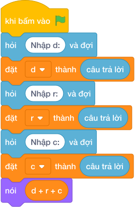

# Hướng Dẫn Giảng Dạy: Thể tích hộp chữ nhật
Chuyên đề: **Lập Trình Thuật Toán & Khối Lệnh Scratch 3.0**

---

## 1. Ý tưởng & Phân tích thuật toán
- Bản chất thể tích hộp chữ nhật: nhân ba kích thước `d * r * c`, mỗi kích thước nằm một dòng riêng.
- Quy trình trong lời giải: đọc `d`, `r`, `c` mỗi biến một lần `câu trả lời`, rồi in `d * r * c`; với mẫu `5`, `3`, `2` thì `5 * 3 * 2 = 30`.
- Xử lý biên: mỗi kích thước từ 1 đến 1000, thể tích lớn nhất là 1000000000, số nguyên luôn vừa.

---

## 2. Bảng chạy tay trên số liệu mẫu (Dry Run Table - Sample 1: 5\n3\n2)
Với số mẫu ba dòng `5`, `3`, `2`, chương trình phải in ra `30`.

| Bước | Hành động | Giá trị biến | Kết quả |
|---|---|---|---|
| 1 | Đọc `d` | `d = 5` | dài 5 |
| 2 | Đọc `r` | `r = 3` | rộng 3 |
| 3 | Đọc `c` | `c = 2` | cao 2 |
| 4 | Tính `d * r * c` | `5 * 3 * 2 = 30` | khớp kết quả mẫu `30` |

---

## 3. Lưu ý & Bẫy lỗi thường gặp
- Bẫy 1 — đọc ba số một dòng: viết `d, r, c = map(int, câu trả lời.split())` thì với mẫu mỗi số một dòng sẽ bị lỗi; cách sửa là đọc ba lần riêng.
- Bẫy 2 — cộng thay vì nhân: viết `nói (d + r + c)` thì với mẫu ra `10` thay vì `30`; cách sửa là nhân ba số.
- Bẫy 3 — nhầm diện tích xung quanh: viết `nói (2 * (d * r + r * c))` thì với mẫu ra số khác `30`; cách sửa là thể tích `d * r * c`.

---

## 4. Lời giải tham khảo & Kịch bản Khối lệnh Scratch 3.0

### 4.1. Khối lệnh đồ họa trực quan (Visual Scratch Blocks)

> 💡 **Kịch bản thực hiện từng bước:**
> - khi bấm vào cờ xanh
> - hỏi [Nhập d:] và đợi
> - đặt [d] thành (câu trả lời)
> - hỏi [Nhập r:] và đợi
> - đặt [r] thành (câu trả lời)
> - hỏi [Nhập c:] và đợi
> - đặt [c] thành (câu trả lời)
> - nói (d + r + c)
