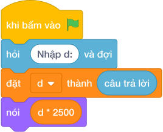

# Hướng Dẫn Giảng Dạy: Đổi đô la sang tiền việt
Chuyên đề: **Lập Trình Thuật Toán & Khối Lệnh Scratch 3.0**

---

## 1. Ý tưởng & Phân tích thuật toán
- Bản chất của bài này là đổi tiền theo tỉ giá cố định: mỗi 1 đô la được 25000 đồng, nên số tiền Việt bằng `d * 25000`.
- Quy trình trong lời giải: đọc biến `d` bằng `int(câu trả lời)`, rồi tính `d * 25000` và in ra; với mẫu `d = 4` thì `4 * 25000 = 100000`.
- Xử lý biên: `D` nhỏ nhất là 1 cho ra 25000 đồng, `D` lớn nhất là 1000000 cho ra 25000000000 đồng, phép nhân số nguyên luôn vừa.

---

## 2. Bảng chạy tay trên số liệu mẫu (Dry Run Table - Sample 1: 4)
Với số mẫu `4`, chương trình phải in ra `100000`.

| Bước | Hành động | Giá trị biến | Kết quả |
|---|---|---|---|
| 1 | Đọc `d = int(câu trả lời)` | `d = 4` | nhận 4 đô la |
| 2 | Tính `d * 25000` | `4 * 25000 = 100000` | 100000 đồng |
| 3 | In kết quả | xuất `100000` | khớp kết quả mẫu `100000` |

---

## 3. Lưu ý & Bẫy lỗi thường gặp
- Bẫy 1 — nhân sai tỉ giá: viết `nói (d * 2500)` thì với mẫu `d = 4` sẽ in ra `10000` thay vì `100000`; cách sửa là nhân đúng `25000`.
- Bẫy 2 — quên đổi chữ thành số: viết `d = câu trả lời` rồi `nói (d * 25000)` thì với mẫu sẽ lặp chuỗi cho ra một dãy rất dài thay vì `100000`; cách sửa là bọc `int(câu trả lời)`.
- Bẫy 3 — in kèm chữ: viết `nói (d * 25000, "dong")` thì với mẫu in ra `100000 dong` thay vì `100000`; cách sửa là chỉ in con số.

---

## 4. Lời giải tham khảo & Kịch bản Khối lệnh Scratch 3.0

### 4.1. Khối lệnh đồ họa trực quan (Visual Scratch Blocks)

> 💡 **Kịch bản thực hiện từng bước:**
> - khi bấm vào cờ xanh
> - hỏi [Nhập d:] và đợi
> - đặt [d] thành (câu trả lời)
> - nói (d * 2500)
