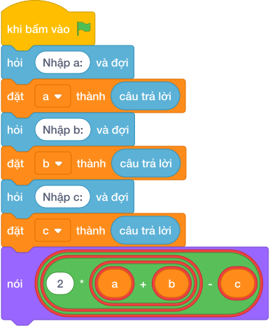

# Hướng Dẫn Giảng Dạy

## 1. Ý tưởng & Phân tích thuật toán
- Bản chất hàng rào: chu vi `2 * (a + b)` trừ cổng `c`, cả ba số nằm trên cùng một dòng.
- Quy trình trong lời giải: đọc một dòng rồi tách thành `a, b, c`, sau đó in `2 * (a + b) - c`; với mẫu `20 15 3` thì chu vi `2 * (20 + 15) = 70` và rào `70 - 3 = 67`.
- Xử lý biên: `A` và `B` tới 10000, `C` nhỏ hơn chu vi nên chiều dài rào luôn dương.

---

## 2. Bảng chạy tay trên số liệu mẫu (Dry Run Table - Sample 1: 20 15 3)
Với số mẫu một dòng `20 15 3`, chương trình phải in ra `67`.

| Bước | Hành động | Giá trị biến | Kết quả |
|---|---|---|---|
| 1 | Đọc `a, b, c` | `a = 20`, `b = 15`, `c = 3` | đủ ba số |
| 2 | Tính `2 * (a + b)` | `2 * 35 = 70` | chu vi 70 |
| 3 | Tính `70 - 3` | `67` | khớp kết quả mẫu `67` |

---

## 3. Lưu ý & Bẫy lỗi thường gặp
- Bẫy 1 — quên trừ cổng: viết `nói (2 * (a + b))` thì với mẫu ra `70` thay vì `67`; cách sửa là trừ thêm `c`.
- Bẫy 2 — thiếu ngoặc: viết `2 * a + b - c` thì với mẫu ra `52` thay vì `67`; cách sửa là `2 * (a + b) - c`.
- Bẫy 3 — đọc ba dòng riêng: dùng ba lần `câu trả lời` thì với mẫu một dòng sẽ bị treo chờ; cách sửa là tách một dòng bằng `split()`.

---

## 4. Lời giải tham khảo & Kịch bản Khối lệnh Scratch 3.0

### 4.1. Khối lệnh đồ họa trực quan (Visual Scratch Blocks)

> 💡 **Kịch bản thực hiện từng bước:**
> - khi bấm vào cờ xanh
> - hỏi [Nhập a:] và đợi
> - đặt [a] thành (câu trả lời)
> - hỏi [Nhập b:] và đợi
> - đặt [b] thành (câu trả lời)
> - hỏi [Nhập c:] và đợi
> - đặt [c] thành (câu trả lời)
> - nói (2 * a + b - c)
