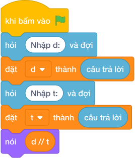

# Hướng Dẫn Giảng Dạy: Tính vận tốc làm tròn
Chuyên đề: **Lập Trình Thuật Toán & Khối Lệnh Scratch 3.0**

---

## 1. Ý tưởng & Phân tích thuật toán
- Bản chất vận tốc trung bình: quãng đường `d` chia thời gian `t`, rồi làm tròn đúng 2 chữ số sau dấu chấm.
- Quy trình trong lời giải: đọc `d` dòng 1 và `t` dòng 2, rồi in `d / t` với 2 chữ số thập phân; với mẫu `d = 100` và `t = 6` thì `100 / 6 = 16.666...` làm tròn thành `16.67`.
- Xử lý biên: `D` và `T` đều từ 1 đến 10000, vận tốc nhỏ nhất là 0.0001, lớn nhất là 10000, luôn in đủ 2 chữ số kể cả số tròn.

---

## 2. Bảng chạy tay trên số liệu mẫu (Dry Run Table - Sample 1: 100\n6)
Với số mẫu dòng 1 là `100` và dòng 2 là `6`, chương trình phải in ra `16.67`.

| Bước | Hành động | Giá trị biến | Kết quả |
|---|---|---|---|
| 1 | Đọc `d` | `d = 100` | quãng đường 100 |
| 2 | Đọc `t` | `t = 6` | thời gian 6 |
| 3 | Tính `d / t` | `100 / 6 = 16.666...` | làm tròn `16.67` khớp mẫu |

---

## 3. Lưu ý & Bẫy lỗi thường gặp
- Bẫy 1 — dùng chia nguyên: viết `nói (d // t)` thì với mẫu ra `16` thay vì `16.67`; cách sửa là chia thực `d / t` rồi làm tròn 2 chữ số.
- Bẫy 2 — in thô không làm tròn: viết `nói (d / t)` thì với mẫu ra `16.666666666666668` thay vì `16.67`; cách sửa là ghi định dạng 2 chữ số thập phân.
- Bẫy 3 — đọc hai số một dòng: viết `d, t = map(int, câu trả lời.split())` thì với mẫu mỗi số một dòng sẽ bị lỗi; cách sửa là đọc hai lần riêng.

---

## 4. Lời giải tham khảo & Kịch bản Khối lệnh Scratch 3.0

### 4.1. Khối lệnh đồ họa trực quan (Visual Scratch Blocks)

> 💡 **Kịch bản thực hiện từng bước:**
> - khi bấm vào cờ xanh
> - hỏi [Nhập d:] và đợi
> - đặt [d] thành (câu trả lời)
> - hỏi [Nhập t:] và đợi
> - đặt [t] thành (câu trả lời)
> - nói (d // t)
