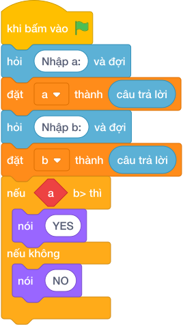

# Hướng Dẫn Giảng Dạy: Ai cao hơn?
Chuyên đề: **Lập Trình Thuật Toán & Khối Lệnh Scratch 3.0**

---

## 1. Ý tưởng & Phân tích thuật toán
- Bản chất của bài này là so sánh hai chiều cao: `a` là của Minh, `b` là của Nam, ai cao hơn thì in tên bạn đó.
- Cách làm của lời giải mẫu: đọc `a` ở dòng một, đọc `b` ở dòng hai, nếu `a > b` thì in `Minh`, ngược lại in `Nam`. Với mẫu `a = 142`, `b = 138`, vì `142 > 138` nên in `Minh`.
- Xử lý biên: ràng buộc `50 <= a, b <= 200` và `a != b` nên không có trường hợp bằng nhau. Thầy cô cho thử cặp ngược lại `a = 138`, `b = 142` thì đáp án là `Nam`.

---

## 2. Bảng chạy tay trên số liệu mẫu (Dry Run Table - Sample 1: 142 rồi 138)
Sample 1 với input mẫu: `142` rồi `138`.
| Bước | Việc làm | Giá trị của `a`, `b` | In ra |
|---|---|---|---|
| 1 | Đọc dòng một | `a = 142` | — |
| 2 | Đọc dòng hai | `b = 138` | — |
| 3 | Kiểm tra `142 > 138`? Đúng | rẽ nhánh `if` | — |
| 4 | In tên bạn cao hơn | — | `Minh` |

---

## 3. Lưu ý & Bẫy lỗi thường gặp
- Bẫy 1 — in chiều cao thay vì tên: bạn nhỏ viết `nói (max(a, b))`. Với mẫu này sẽ in `142` thay vì `Minh`. Cách sửa: in chuỗi tên như lời giải mẫu.
- Bẫy 2 — sai chữ hoa thường: bạn nhỏ in `minh` hoặc `MINH`. Với mẫu `142` và `138`, chương trình kiểm tra sẽ báo kết quả sai. Cách sửa: viết đúng `Minh` và `Nam`, chữ đầu viết hoa.
- Bẫy 3 — đọc hai số trên một dòng mà không tách: nếu chỉ gọi `int(câu trả lời)` một lần cho input `142 138` thì chương trình lỗi. Cách sửa: đọc hai dòng như lời giải mẫu.

---

## 4. Lời giải tham khảo & Kịch bản Khối lệnh Scratch 3.0

### 4.1. Khối lệnh đồ họa trực quan (Visual Scratch Blocks)

> 💡 **Kịch bản thực hiện từng bước:**
> - khi bấm vào cờ xanh
> - hỏi [Nhập a:] và đợi
> - đặt [a] thành (câu trả lời)
> - hỏi [Nhập b:] và đợi
> - đặt [b] thành (câu trả lời)
> - nếu <a > b> thì:
> -   nói [YES]
> - nếu không thì:
> -   nói [NO]
