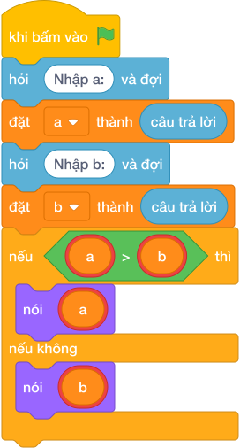

# Hướng Dẫn Giảng Dạy

## 1. Ý tưởng & Phân tích thuật toán
- Bản chất của bài này là phép so sánh hai số: với hai số `a = -15` và `b = 8`, đáp án chính là số đứng sau trên trục số.
- Cách làm của lời giải mẫu: đọc `a` ở dòng một, đọc `b` ở dòng hai, rồi gọi `max(a, b)` để lấy số lớn hơn và in ra.
- Xử lý biên: ràng buộc cho phép `a, b` xuống tới `-10^9` và lên tới `10^9`. Với mẫu `-15` và `8`, vì `-15 < 8` nên kết quả là `8`. Nếu cả hai số đều âm, ví dụ `-20` và `-5`, đáp án vẫn là số ít âm hơn (`-5`).

---

## 2. Bảng chạy tay trên số liệu mẫu (Dry Run Table - Sample 1: -15 rồi 8)
Sample 1 với input mẫu: `-15` rồi `8`.
| Bước | Việc làm | Giá trị của `a`, `b` | In ra |
|---|---|---|---|
| 1 | Đọc dòng một | `a = -15` | — |
| 2 | Đọc dòng hai | `b = 8` | — |
| 3 | So sánh: `-15` có lớn hơn `8` không? Không | giữ `a = -15, b = 8` | — |
| 4 | Gọi `max(-15, 8)` được `8` rồi in ra | — | `8` |

---

## 3. Lưu ý & Bẫy lỗi thường gặp
- Bẫy 1 — chỉ đọc một số: bạn nhỏ viết `a = câu trả lời` rồi `nói (a)`. Với mẫu `-15` và `8`, chương trình chỉ in `-15`, thiếu hẳn số thứ hai. Cách sửa: đọc thêm dòng `b = câu trả lời` rồi mới so sánh.
- Bẫy 2 — in nhầm số bé: bạn nhỏ viết `nói (min(a, b))`. Với mẫu này sẽ in `-15` thay vì `8`. Cách sửa: đổi thành `nói (max(a, b))`.
- Bẫy 3 — đọc hai số trên cùng một dòng mà không tách: nếu đề cho `-15 8` trên một dòng mà chỉ gọi `câu trả lời` một lần thì thiếu số. Cách sửa: đọc hai dòng như lời giải mẫu, hoặc tách chuỗi khi cần.

---

## 4. Lời giải tham khảo & Kịch bản Khối lệnh Scratch 3.0

### 4.1. Khối lệnh đồ họa trực quan (Visual Scratch Blocks)

> 💡 **Kịch bản thực hiện từng bước:**
> - khi bấm vào cờ xanh
> - hỏi [Nhập a:] và đợi
> - đặt [a] thành (câu trả lời)
> - hỏi [Nhập b:] và đợi
> - đặt [b] thành (câu trả lời)
> - nếu <a > b> thì:
> -   nói (a)
> - nếu không thì:
> -   nói (b)
