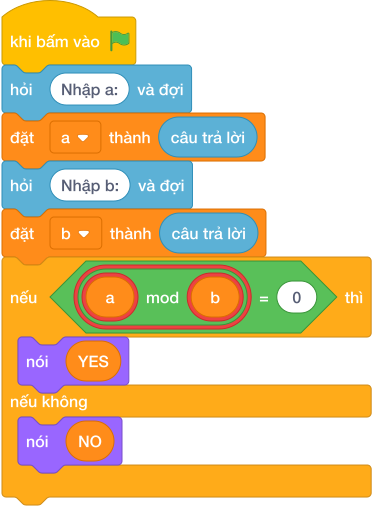

# Hướng Dẫn Giảng Dạy

## 1. Ý tưởng & Phân tích thuật toán
- Bản chất của bài này là phép chia hết: `a` chiếc kẹo chia cho `b` bạn, nếu `(a mod b) == 0` thì vừa khít.
- Cách làm của lời giải mẫu: đọc linh hoạt cả hai kiểu (hai số trên một dòng hoặc mỗi số một dòng) rồi kiểm tra `(a mod b)`. Với mẫu `a = 20`, `b = 4`: `(20 mod 4) = 0` nên in `YES`.
- Xử lý biên: ràng buộc `1 <= a, b <= 10^6`. Thầy cô cho thử `a = 20`, `b = 6`: `(20 mod 6) = 2` khác `0` nên in `NO`, mỗi bạn được `3` cái và dư `2` cái.

---

## 2. Bảng chạy tay trên số liệu mẫu (Dry Run Table - Sample 1: 20 rồi 4)
Sample 1 với input mẫu: `20` rồi `4`.
| Bước | Việc làm | Giá trị các biến | In ra |
|---|---|---|---|
| 1 | Đọc dòng một, tách ra | `a = 20` (dòng một chỉ một số) | — |
| 2 | Đọc dòng hai | `b = 4` | — |
| 3 | Tính `(20 mod 4) = 0`, điều kiện đúng | rẽ nhánh `if` | — |
| 4 | In kết quả | — | `YES` |

---

## 3. Lưu ý & Bẫy lỗi thường gặp
- Bẫy 1 — chia thường thay vì chia dư: bạn nhỏ viết `if a / b == 0`. Với `a = 20, b = 4`, `20 / 4 = 5.0` khác `0` nên luôn in `NO`. Cách sửa: dùng `(a mod b) == 0`.
- Bẫy 2 — đọc cứng hai dòng: bạn nhỏ gọi `câu trả lời` hai lần mà không tách. Với input `20 4` trên một dòng sẽ lỗi hoặc thiếu. Cách sửa: tách dòng đầu rồi mới đọc tiếp như lời giải mẫu.
- Bẫy 3 — in chữ thường `yes`: bạn nhỏ in `yes`. Với mẫu `20` và `4`, chương trình kiểm tra sẽ báo kết quả sai. Cách sửa: in đúng `YES` và `NO` viết hoa toàn bộ.

---

## 4. Lời giải tham khảo & Kịch bản Khối lệnh Scratch 3.0

### 4.1. Khối lệnh đồ họa trực quan (Visual Scratch Blocks)

> 💡 **Kịch bản thực hiện từng bước:**
> - khi bấm vào cờ xanh
> - hỏi [Nhập a:] và đợi
> - đặt [a] thành (câu trả lời)
> - hỏi [Nhập b:] và đợi
> - đặt [b] thành (câu trả lời)
> - nếu <a mod b = 0> thì:
> -   nói (YES)
> - nếu không thì:
> -   nói (NO)
