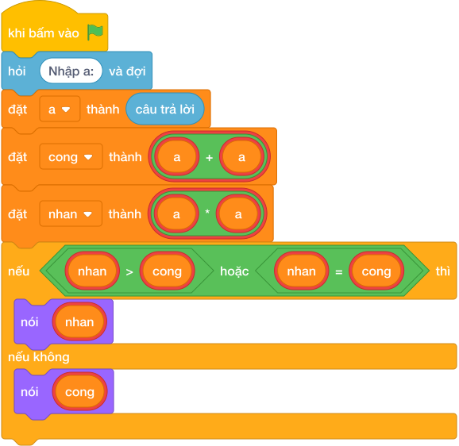

# Hướng Dẫn Giảng Dạy

## 1. Ý tưởng & Phân tích thuật toán
- Bản chất của bài này là thử cả ba cách rồi chọn số to nhất: với số `a`, ba ứng viên là `a + a`, `a - a` (luôn bằng `0`) và `a * a`.
- Cách làm của lời giải mẫu: tính `cong = a + a` và `nhan = a * a`, nếu `nhan >= cong` thì in `nhan`, ngược lại in `cong`. Với mẫu `a = 3`: `cong = 6`, `nhan = 9`, vì `9 >= 6` nên in `9`.
- Xử lý biên: ràng buộc `0 <= A <= 100`. Hai mốc cần nhớ là `A = 0` (`cong = 0`, `nhan = 0`, đáp án `0`) và `A = 1` (`cong = 2`, `nhan = 1`, đáp án `2`, phép cộng thắng).

---

## 2. Bảng chạy tay trên số liệu mẫu (Dry Run Table - Sample 1: 3)
Sample 1 với input mẫu: `3`.
| Bước | Việc làm | Giá trị các biến | In ra |
|---|---|---|---|
| 1 | Đọc input | `a = 3` | — |
| 2 | Tính `cong = 3 + 3` | `cong = 6` | — |
| 3 | Tính `nhan = 3 * 3` | `nhan = 9` | — |
| 4 | So sánh `9 >= 6`? Đúng, chọn `nhan` | — | `9` |

---

## 3. Lưu ý & Bẫy lỗi thường gặp
- Bẫy 1 — luôn in phép cộng: bạn nhỏ viết `nói (a + a)`. Với mẫu `3` sẽ in `6` thay vì `9`. Cách sửa: tính thêm `a * a` rồi so sánh như lời giải mẫu.
- Bẫy 2 — luôn in phép nhân: bạn nhỏ viết `nói (a * a)`. Với `a = 1` sẽ in `1` thay vì `2`. Cách sửa: giữ phép so sánh `if nhan >= cong`.
- Bẫy 3 — quên mất phép trừ cho kết quả `0`: có bạn lo phép trừ thắng khi `a = 0`. Thực ra với `a = 0` thì cả ba phép đều `0`, in `0` vẫn đúng. Cách sửa: chỉ cần so sánh cộng và nhân như lời giải mẫu là đủ.

---

## 4. Lời giải tham khảo & Kịch bản Khối lệnh Scratch 3.0

### 4.1. Khối lệnh đồ họa trực quan (Visual Scratch Blocks)

> 💡 **Kịch bản thực hiện từng bước:**
> - khi bấm vào cờ xanh
> - hỏi [Nhập a:] và đợi
> - đặt [a] thành (câu trả lời)
> - đặt [cong] thành (a + a)
> - đặt [nhan] thành (a * a)
> - nếu <nhan >= cong> thì:
> -   nói (nhan)
> - nếu không thì:
> -   nói (cong)
