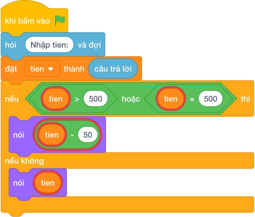

# Hướng Dẫn Giảng Dạy

## 1. Ý tưởng & Phân tích thuật toán
- Bản chất của bài này là một mốc giảm giá duy nhất `500`: đơn từ `500` nghìn trở lên được bớt `50` nghìn, dưới `500` thì giữ nguyên.
- Cách làm của lời giải mẫu: đọc `tien`, nếu `tien >= 500` thì in `tien - 50`, ngược lại in `tien`. Với mẫu `tien = 620`, vì `620 >= 500` nên in `620 - 50 = 570`.
- Xử lý biên: ràng buộc `1 <= N <= 10^6`. Hai mốc cần thử là `N = 500` (vừa chạm mốc, trả `450`) và `N = 499` (thấp hơn một đơn vị, trả nguyên `499`).

---

## 2. Bảng chạy tay trên số liệu mẫu (Dry Run Table - Sample 1: 620)
Sample 1 với input mẫu: `620`.
| Bước | Việc làm | Giá trị của `tien` | In ra |
|---|---|---|---|
| 1 | Đọc input | `tien = 620` | — |
| 2 | Kiểm tra `620 >= 500`? Đúng | rẽ nhánh `if` | — |
| 3 | Tính `620 - 50 = 570` rồi in | — | `570` |

---

## 3. Lưu ý & Bẫy lỗi thường gặp
- Bẫy 1 — viết `>` thay vì `>=`: bạn nhỏ viết `if tien > 500`. Với `tien = 500` sẽ không được giảm, in `500` thay vì `450`. Cách sửa: dùng `>=` như lời giải mẫu.
- Bẫy 2 — trừ nhầm số: bạn nhỏ viết `nói (tien - 500)` hoặc `nói (50)`. Với mẫu `620` sẽ in `120` hoặc `50`, sai. Cách sửa: chỉ bớt đúng `50`, thành `tien - 50`.
- Bẫy 3 — giảm cho cả đơn nhỏ: bạn nhỏ trừ `50` cho mọi đơn. Với `N = 450` sẽ in `400` thay vì `450`. Cách sửa: giữ nhánh `else` in nguyên `tien`.

---

## 4. Lời giải tham khảo & Kịch bản Khối lệnh Scratch 3.0

### 4.1. Khối lệnh đồ họa trực quan (Visual Scratch Blocks)

> 💡 **Kịch bản thực hiện từng bước:**
> - khi bấm vào cờ xanh
> - hỏi [Nhập tien:] và đợi
> - đặt [tien] thành (câu trả lời)
> - nếu <tien >= 500> thì:
> -   nói (tien - 50)
> - nếu không thì:
> -   nói (tien)
