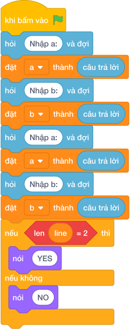

# Hướng Dẫn Giảng Dạy: Cặp số bằng nhau hay khác?
Chuyên đề: **Lập Trình Thuật Toán & Khối Lệnh Scratch 3.0**

---

## 1. Ý tưởng & Phân tích thuật toán
- Bản chất của bài này là so sánh hai số `a, b`: `a > b` in `a LON HON b`, `a < b` in `a NHO HON b`, bằng nhau in `HAI SO BANG NHAU`.
- Cách làm của lời giải mẫu: đọc linh hoạt cả hai kiểu (hai số trên một dòng hoặc mỗi số một dòng) rồi rẽ ba nhánh. Với mẫu `15 28`: `15 > 28` sai, `15 < 28` đúng nên in `a NHO HON b`.
- Xử lý biên: ràng buộc `-10^9 <= a, b <= 10^9`. Thầy cô cho thử `a = 28, b = 15` (in `a LON HON b`) và `a = 7, b = 7` (in `HAI SO BANG NHAU`).

---

## 2. Bảng chạy tay trên số liệu mẫu (Dry Run Table - Sample 1: 15 28)
Sample 1 với input mẫu: `15 28`.
| Bước | Việc làm | Giá trị các biến | In ra |
|---|---|---|---|
| 1 | Đọc một dòng, tách hai số | `a = 15, b = 28` | — |
| 2 | Kiểm tra `15 > 28`? Sai | xuống nhánh `elif` | — |
| 3 | Kiểm tra `15 < 28`? Đúng | rẽ nhánh hai | — |
| 4 | In kết quả | — | `a NHO HON b` |

---

## 3. Lưu ý & Bẫy lỗi thường gặp
- Bẫy 1 — in `A` hoa: bạn nhỏ viết `nói ("A LON HON B")`. Với mẫu `15 28`, chương trình kiểm tra sẽ báo kết quả sai vì đề viết `a` thường. Cách sửa: chép đúng `a LON HON b`, `a NHO HON b`, `HAI SO BANG NHAU`.
- Bẫy 2 — quên nhánh bằng nhau: bạn nhỏ chỉ viết `if/else` cho lớn và nhỏ. Với `a = 7, b = 7` sẽ in `a NHO HON b`, sai. Cách sửa: giữ đủ ba nhánh như lời giải mẫu.
- Bẫy 3 — đọc cứng một dòng: bạn nhỏ chỉ tách một dòng mà không đọc tiếp. Với input mỗi số một dòng (`15` rồi `28`) sẽ thiếu `b`. Cách sửa: đọc linh hoạt như lời giải mẫu.

---

## 4. Lời giải tham khảo & Kịch bản Khối lệnh Scratch 3.0

### 4.1. Khối lệnh đồ họa trực quan (Visual Scratch Blocks)

> 💡 **Kịch bản thực hiện từng bước:**
> - khi bấm vào cờ xanh
> - hỏi [Nhập a:] và đợi
> - đặt [a] thành (câu trả lời)
> - hỏi [Nhập b:] và đợi
> - đặt [b] thành (câu trả lời)
> - hỏi [Nhập a:] và đợi
> - đặt [a] thành (câu trả lời)
> - hỏi [Nhập b:] và đợi
> - đặt [b] thành (câu trả lời)
> - nếu <len(line) = 2> thì:
> -   nói [YES]
> - nếu không thì:
> -   nói [NO]
