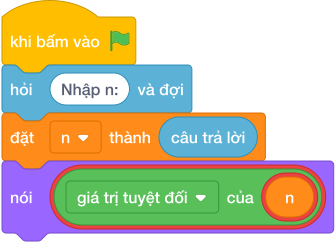

# Hướng Dẫn Giảng Dạy

## 1. Ý tưởng & Phân tích thuật toán
- Bản chất của bài này là khoảng cách từ điểm `n` tới mốc số 0: số âm thì lật dấu thành dương, số dương và số 0 giữ nguyên.
- Cách làm của lời giải mẫu: đọc `n`, gọi `abs(n)` rồi in ra. Với mẫu `n = -25`, `abs(-25)` cho `25`.
- Xử lý biên: ràng buộc cho phép `N` từ `-10^9` tới `10^9`. Hai mốc cần nhớ là `N = 0` cho kết quả `0`, và `N = -10^9` cho kết quả `10^9`.

---

## 2. Bảng chạy tay trên số liệu mẫu (Dry Run Table - Sample 1: -25)
Sample 1 với input mẫu: `-25`.
| Bước | Việc làm | Giá trị của `n` | In ra |
|---|---|---|---|
| 1 | Đọc input, `n = int(câu trả lời)` | `n = -25` | — |
| 2 | Gọi `abs(-25)` | `25` | — |
| 3 | In kết quả | — | `25` |

---

## 3. Lưu ý & Bẫy lỗi thường gặp
- Bẫy 1 — quên số âm: bạn nhỏ viết `nói (n)` thẳng. Với mẫu `-25` sẽ in `-25` thay vì `25`. Cách sửa: bọc thêm `abs`, thành `nói (abs(n))`.
- Bẫy 2 — tự trừ mà sai dấu: bạn nhỏ viết `nói (0 - n)` cho mọi trường hợp. Với `n = 10` (số dương) sẽ in `-10`, sai. Cách sửa: dùng `abs(n)` để cả hai phía đều đúng.
- Bẫy 3 — bình phương rồi căn: bạn nhỏ viết `nói (n * n)` để cho chắc dương. Với mẫu `-25` sẽ in `625` thay vì `25`. Cách sửa: dùng `abs(n)` thay cho nhân đôi.

---

## 4. Lời giải tham khảo & Kịch bản Khối lệnh Scratch 3.0

### 4.1. Khối lệnh đồ họa trực quan (Visual Scratch Blocks)

> 💡 **Kịch bản thực hiện từng bước:**
> - khi bấm vào cờ xanh
> - hỏi [Nhập n:] và đợi
> - đặt [n] thành (câu trả lời)
> - nói (abs(...))
