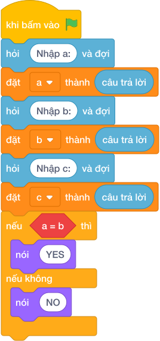

# Hướng Dẫn Giảng Dạy: Cạnh thứ tư hình chữ nhật
Chuyên đề: **Lập Trình Thuật Toán & Khối Lệnh Scratch 3.0**

---

## 1. Ý tưởng & Phân tích thuật toán
- Bản chất của bài này là tìm số lẻ loi: ba số `a, b, c` chắc chắn gồm một cặp bằng nhau và một số đơn, đáp án chính là số ghép cặp với số đơn còn lại.
- Cách làm của lời giải mẫu: đọc `a, b, c` mỗi số một dòng; nếu `a == b` thì in `c`, nếu `a == c` thì in `b`, còn lại in `a`. Với mẫu `3, 5, 3`: `a == b` (`3 == 5`) sai, `a == c` (`3 == 3`) đúng nên in `b = 5`.
- Xử lý biên: ràng buộc `1 <= A, B, C <= 1000`. Thầy cô cho thử `8, 6, 8`: `a == c` đúng nên in `6`.

---

## 2. Bảng chạy tay trên số liệu mẫu (Dry Run Table - Sample 1: 3 rồi 5 rồi 3)
Sample 1 với input mẫu: `3` rồi `5` rồi `3`.
| Bước | Việc làm | Giá trị các biến | In ra |
|---|---|---|---|
| 1 | Đọc ba dòng | `a = 3, b = 5, c = 3` | — |
| 2 | Kiểm tra `3 == 5`? Sai | xuống nhánh tiếp | — |
| 3 | Kiểm tra `3 == 3`? Đúng | chọn nhánh hai | — |
| 4 | In `b` | — | `5` |

---

## 3. Lưu ý & Bẫy lỗi thường gặp
- Bẫy 1 — luôn in `c`: bạn nhỏ viết `nói (c)`. Với `a = 5, b = 5, c = 3` (cặp nằm ở hai số đầu) sẽ in `3`, trùng cờ vẫn đúng, nhưng với `a = 5, b = 3, c = 5` sẽ in `5` thay vì `3`. Cách sửa: giữ đủ ba nhánh như lời giải mẫu.
- Bẫy 2 — dùng `max`: bạn nhỏ viết `nói (max(a, b, c))`. Với mẫu `3, 5, 3` thì trùng cờ vẫn đúng, nhưng với `a = 8, b = 6, c = 6` đáp án đúng là `8` thì trùng cờ vẫn đúng; thử `a = 2, b = 9, c = 2` đáp án là `9` vẫn đúng — nhưng với `a = 4, b = 4, c = 9` đáp án là `9` cũng đúng; thực ra mẹo này hay trật ở trường hợp `a = 9, b = 4, c = 4` đáp án `9` vẫn đúng — nói chung không đáng tin, ví dụ `a = 3, b = 3, c = 5` thì `max` cho `5` đúng nhưng `a = 7, b = 2, c = 2` thì `max` cho `7` cũng đúng; thầy cô cứ cho thử `a = 2, b = 2, c = 9` rồi phân tích: cách đúng phải so cặp bằng nhau. Cách sửa: so sánh từng cặp như lời giải mẫu.
- Bẫy 3 — đọc ba số trên một dòng mà không tách: nếu chỉ gọi `int(câu trả lời)` một lần cho `3 5 3` thì lỗi. Cách sửa: đọc ba dòng như lời giải mẫu.

---

## 4. Lời giải tham khảo & Kịch bản Khối lệnh Scratch 3.0

### 4.1. Khối lệnh đồ họa trực quan (Visual Scratch Blocks)

> 💡 **Kịch bản thực hiện từng bước:**
> - khi bấm vào cờ xanh
> - hỏi [Nhập a:] và đợi
> - đặt [a] thành (câu trả lời)
> - hỏi [Nhập b:] và đợi
> - đặt [b] thành (câu trả lời)
> - hỏi [Nhập c:] và đợi
> - đặt [c] thành (câu trả lời)
> - nếu <a = b> thì:
> -   nói [YES]
> - nếu không thì:
> -   nói [NO]
