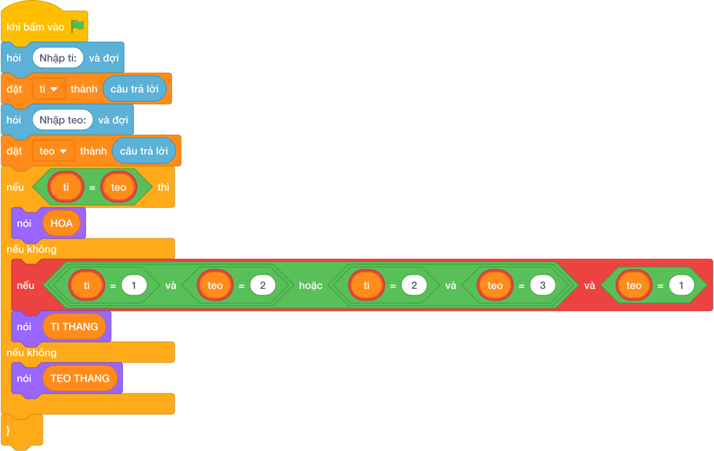

# Hướng Dẫn Giảng Dạy

## 1. Ý tưởng & Phân tích thuật toán
- Bản chất của bài này là luật thắng vòng tròn: `1` (Búa) thắng `2` (Kéo), `2` (Kéo) thắng `3` (Bao), `3` (Bao) thắng `1` (Búa); ra cùng số thì `HOA`.
- Cách làm của lời giải mẫu: đọc `ti` và `teo` linh hoạt cả hai kiểu input; nếu `ti == teo` in `HOA`, nếu `(ti == 1 and teo == 2) or (ti == 2 and teo == 3) or (ti == 3 and teo == 1)` thì in `TI THANG`, còn lại in `TEO THANG`. Với mẫu `1` và `2`: cặp `(1, 2)` nằm trong nhóm Tí thắng nên in `TI THANG`.
- Xử lý biên: mỗi lựa chọn chỉ là `1, 2, 3`. Thầy cô cho thử `1` và `3` (Bao thắng Búa, in `TEO THANG`) và `2` và `2` (in `HOA`).

---

## 2. Bảng chạy tay trên số liệu mẫu (Dry Run Table - Sample 1: 1 rồi 2)
Sample 1 với input mẫu: `1` rồi `2`.
| Bước | Việc làm | Giá trị các biến | In ra |
|---|---|---|---|
| 1 | Đọc dòng một | `ti = 1` (dòng một chỉ một số) | — |
| 2 | Đọc dòng hai | `teo = 2` | — |
| 3 | Kiểm tra `1 == 2`? Sai | xuống kiểm tra thắng | — |
| 4 | Cặp `(1, 2)` thuộc nhóm Tí thắng? Đúng | rẽ nhánh hai | — |
| 5 | In kết quả | — | `TI THANG` |

---

## 3. Lưu ý & Bẫy lỗi thường gặp
- Bẫy 1 — quên nhánh hòa: bạn nhỏ chỉ viết nhánh Tí thắng và còn lại Tèo thắng. Với `2` và `2` sẽ in `TEO THANG`, sai. Cách sửa: kiểm tra `ti == teo` trước tiên như lời giải mẫu.
- Bẫy 2 — liệt thiếu cặp thắng: bạn nhỏ chỉ viết hai cặp `(1, 2)` và `(2, 3)` mà quên `(3, 1)`. Với `ti = 3, teo = 1` sẽ in `TEO THANG`, sai. Cách sửa: giữ đủ ba cặp nối bằng `or`.
- Bẫy 3 — đọc cứng hai dòng: bạn nhỏ gọi `câu trả lời` hai lần mà không tách. Với input `1 2` trên một dòng sẽ thiếu. Cách sửa: tách dòng đầu rồi mới đọc tiếp như lời giải mẫu.

---

## 4. Lời giải tham khảo & Kịch bản Khối lệnh Scratch 3.0

### 4.1. Khối lệnh đồ họa trực quan (Visual Scratch Blocks)

> 💡 **Kịch bản thực hiện từng bước:**
> - khi bấm vào cờ xanh
> - hỏi [Nhập ti:] và đợi
> - đặt [ti] thành (câu trả lời)
> - hỏi [Nhập teo:] và đợi
> - đặt [teo] thành (câu trả lời)
> - nếu <ti = teo> thì:
> -   nói (HOA)
> - nếu không thì:
> -   nếu <điều kiện> thì:
> -     nói (TI THANG)
> -   nếu không thì:
> -     nói (TEO THANG)
