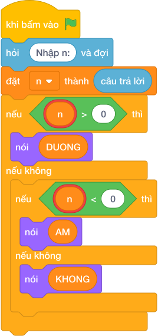

# Hướng Dẫn Giảng Dạy

## 1. Ý tưởng & Phân tích thuật toán
- Bản chất của bài này là phân ba nhóm trên trục số: `n > 0` là `DUONG`, `n < 0` là `AM`, còn lại `n == 0` là `KHONG`.
- Cách làm của lời giải mẫu: đọc `n`, rẽ ba nhánh `if n > 0`, `elif n < 0`, `else`. Với mẫu `n = -15`, vì `-15 < 0` nên rơi vào nhánh hai, in `AM`.
- Xử lý biên: ràng buộc `-10^9 <= N <= 10^9`. Hai mốc cần thử là `n = 0` (in `KHONG`) và `n = 1` (in `DUONG`).

---

## 2. Bảng chạy tay trên số liệu mẫu (Dry Run Table - Sample 1: -15)
Sample 1 với input mẫu: `-15`.
| Bước | Việc làm | Giá trị của `n` | In ra |
|---|---|---|---|
| 1 | Đọc input | `n = -15` | — |
| 2 | Kiểm tra `-15 > 0`? Sai | xuống nhánh `elif` | — |
| 3 | Kiểm tra `-15 < 0`? Đúng | rẽ nhánh hai | — |
| 4 | In theo nhánh | — | `AM` |

---

## 3. Lưu ý & Bẫy lỗi thường gặp
- Bẫy 1 — quên nhánh số 0: bạn nhỏ chỉ viết `if/else` cho dương và âm. Với `n = 0` sẽ in `AM`, sai. Cách sửa: giữ đủ ba nhánh như lời giải mẫu, nhánh cuối in `KHONG`.
- Bẫy 2 — đảo dấu: bạn nhỏ viết `if n > 0: nói ("AM")`. Với mẫu `-15` sẽ rơi sang `else` rồi in sai. Cách sửa: `n > 0` đi với `DUONG`, `n < 0` đi với `AM`.
- Bẫy 3 — in `0` thay vì `KHONG`: bạn nhỏ viết `nói (n)` ở nhánh cuối. Với `n = 0` sẽ in `0`, sai. Cách sửa: in đúng chuỗi `KHONG`.

---

## 4. Lời giải tham khảo & Kịch bản Khối lệnh Scratch 3.0

### 4.1. Khối lệnh đồ họa trực quan (Visual Scratch Blocks)

> 💡 **Kịch bản thực hiện từng bước:**
> - khi bấm vào cờ xanh
> - hỏi [Nhập n:] và đợi
> - đặt [n] thành (câu trả lời)
> - nếu <n > 0> thì:
> -   nói (DUONG)
> - nếu không thì:
> -   nếu <n < 0> thì:
> -     nói (AM)
> -   nếu không thì:
> -     nói (KHONG)
