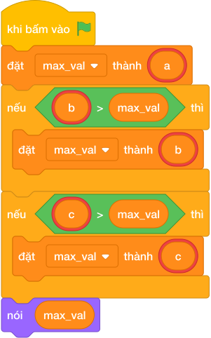

# Hướng Dẫn Giảng Dạy

## 1. Ý tưởng & Phân tích thuật toán
- Bản chất của bài này là tìm số đứng sau cùng trên trục số trong ba số `a, b, c`.
- Cách làm của lời giải mẫu: đọc khéo cả hai kiểu input (ba số trên một dòng hoặc mỗi số một dòng) rồi gọi `max(a, b, c)` và in ra. Với mẫu `15, 28, 9`, `max(15, 28, 9)` cho `28`.
- Xử lý biên: ràng buộc `-10^9 <= a, b, c <= 10^9`. Thầy cô cho thử ba số âm `a = -5, b = -2, c = -9` thì đáp án là `-2` (số ít âm nhất).

---

## 2. Bảng chạy tay trên số liệu mẫu (Dry Run Table - Sample 1: 15 rồi 28 rồi 9)
Sample 1 với input mẫu: `15` rồi `28` rồi `9`.
| Bước | Việc làm | Giá trị các biến | In ra |
|---|---|---|---|
| 1 | Đọc dòng một, tách ra | `line = ['15']`, `a = 15` | — |
| 2 | Đọc tiếp hai dòng | `b = 28`, `c = 9` | — |
| 3 | Gọi `max(15, 28, 9)` được `28` | — | — |
| 4 | In kết quả | — | `28` |

---

## 3. Lưu ý & Bẫy lỗi thường gặp
- Bẫy 1 — chỉ so hai số đầu: bạn nhỏ viết `nói (max(a, b))`. Với mẫu `15, 28, 9` thì trùng cờ vẫn đúng, nhưng nếu `c = 99` sẽ in `28`, sai. Cách sửa: cho cả ba số vào `max(a, b, c)`.
- Bẫy 2 — đọc cứng ba dòng: bạn nhỏ gọi `câu trả lời` ba lần mà không tách. Với input `15 28 9` trên một dòng, `a = int('15 28 9')` sẽ lỗi. Cách sửa: đọc linh hoạt như lời giải mẫu (tách dòng đầu rồi mới đọc tiếp).
- Bẫy 3 — in kèm chữ: bạn nhỏ viết `nói ("So lon nhat:", max(a, b, c))`. Với mẫu này sẽ in thừa chữ, chương trình kiểm tra báo kết quả sai. Cách sửa: chỉ in số trơ trụi.

---

## 4. Lời giải tham khảo & Kịch bản Khối lệnh Scratch 3.0

### 4.1. Khối lệnh đồ họa trực quan (Visual Scratch Blocks)

> 💡 **Kịch bản thực hiện từng bước:**
> - khi bấm vào cờ xanh
> - đặt [max_val] thành (a)
> - nếu <b > max_val> thì:
> -   đặt [max_val] thành (b)
> - nếu <c > max_val> thì:
> -   đặt [max_val] thành (c)
> - nói (max_val)
