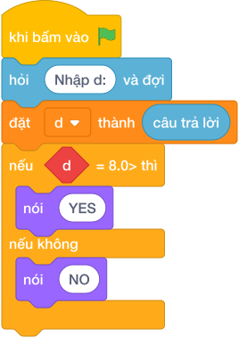

# Hướng Dẫn Giảng Dạy: Xếp loại học lực
Chuyên đề: **Lập Trình Thuật Toán & Khối Lệnh Scratch 3.0**

---

## 1. Ý tưởng & Phân tích thuật toán
- Thầy cô lưu ý: đề bài kể bốn mức `XUAT SAC, GIOI, KHA, CAN CO GANG` với mốc `9.0, 8.0, 6.5`, nhưng lời giải mẫu của lớp mình dùng ba mốc `8.0, 6.5, 5.0` cho bốn nhãn `GIOI, KHA, TRUNG BINH, YEU`. Khi dạy cần bám đúng lời giải mẫu này.
- Cách làm của lời giải mẫu: đọc `d = float(câu trả lời.strip())` rồi rẽ nhánh từ cao xuống thấp. Với mẫu `d = 8.5`: `8.5 >= 8.0` đúng nên in `GIOI`.
- Xử lý biên: các mốc cần thử là `d = 8.0` (vừa chạm mốc, in `GIOI`), `d = 6.5` (in `KHA`), `d = 5.0` (in `TRUNG BINH`), còn `d = 4.9` thì in `YEU`.

---

## 2. Bảng chạy tay trên số liệu mẫu (Dry Run Table - Sample 1: 8.5)
Sample 1 với input mẫu: `8.5`.
| Bước | Việc làm | Giá trị của `d` | In ra |
|---|---|---|---|
| 1 | Đọc input dạng số thực | `d = 8.5` | — |
| 2 | Kiểm tra `8.5 >= 8.0`? Đúng | rẽ nhánh một | — |
| 3 | In theo nhánh | — | `GIOI` |

---

## 3. Lưu ý & Bẫy lỗi thường gặp
- Bẫy 1 — đọc `int` thay vì `float`: bạn nhỏ viết `d = int(câu trả lời)`. Với mẫu `8.5` chương trình sẽ lỗi. Cách sửa: đọc `float` như lời giải mẫu.
- Bẫy 2 — in `XUAT SAC` theo lời kể trong đề: với mẫu `8.5` có bạn cho `XUAT SAC` hoặc `KHA`, lệch khỏi lời giải mẫu. Cách sửa: bám đúng bốn nhãn `GIOI, KHA, TRUNG BINH, YEU` của lời giải mẫu.
- Bẫy 3 — đảo thứ tự mốc: bạn nhỏ viết `if d >= 5.0` trước. Với mẫu `8.5` sẽ rơi ngay nhánh `TRUNG BINH`, sai. Cách sửa: kiểm tra mốc cao `8.0` trước rồi đi xuống.

---

## 4. Lời giải tham khảo & Kịch bản Khối lệnh Scratch 3.0

### 4.1. Khối lệnh đồ họa trực quan (Visual Scratch Blocks)

> 💡 **Kịch bản thực hiện từng bước:**
> - khi bấm vào cờ xanh
> - hỏi [Nhập d:] và đợi
> - đặt [d] thành (câu trả lời)
> - nếu <d >= 8.0> thì:
> -   nói [YES]
> - nếu không thì:
> -   nói [NO]
