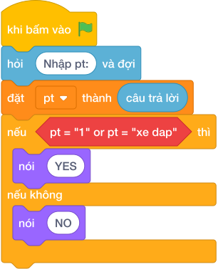

# Hướng Dẫn Giảng Dạy: Vé gửi xe bến bãi
Chuyên đề: **Lập Trình Thuật Toán & Khối Lệnh Scratch 3.0**

---

## 1. Ý tưởng & Phân tích thuật toán
- Bản chất của bài này là tra bảng giá theo mã đã viết thường: `pt` là `1` hoặc `xe dap` thì `2000`, là `2` hoặc `xe may` thì `5000`, là `3` hoặc `o to` thì `30000`, còn lại in `LOI PHUONG TIEN`.
- Cách làm của lời giải mẫu: đọc `pt = câu trả lời.strip().lower()` rồi rẽ bốn nhánh. Với mẫu `xe may`: viết thường vẫn là `xe may`, rơi vào nhánh hai nên in `5000`.
- Xử lý biên: thầy cô cho thử `XE DAP` viết hoa (nhờ `.lower()` nên vẫn nhận, in `2000`) và mã lạ `5` (in `LOI PHUONG TIEN`).

---

## 2. Bảng chạy tay trên số liệu mẫu (Dry Run Table - Sample 1: xe may)
Sample 1 với input mẫu: `xe may`.
| Bước | Việc làm | Giá trị của `pt` | In ra |
|---|---|---|---|
| 1 | Đọc input, cắt khoảng trắng, viết thường | `pt = 'xe may'` | — |
| 2 | Kiểm tra nhánh một (`1` / `xe dap`)? Sai | xuống nhánh hai | — |
| 3 | Kiểm tra `pt == '2' or pt == 'xe may'`? Đúng | rẽ nhánh hai | — |
| 4 | In `5000` | — | `5000` |

---

## 3. Lưu ý & Bẫy lỗi thường gặp
- Bẫy 1 — quên viết thường: bạn nhỏ viết `pt = câu trả lời.strip()` rồi so với `'xe may'`. Với mẫu `XE MAY` viết hoa sẽ không khớp, in `LOI PHUONG TIEN`, sai. Cách sửa: thêm `.lower()` như lời giải mẫu.
- Bẫy 2 — đọc `int` cho mã số: bạn nhỏ viết `pt = int(câu trả lời)`. Với mẫu `xe may` chương trình sẽ lỗi. Cách sửa: đọc chuỗi như lời giải mẫu để nhận cả số và chữ.
- Bẫy 3 — quên nhánh mã lạ: bạn nhỏ chỉ viết ba nhánh xe mà không có `else`. Với mã `5` sẽ không in gì. Cách sửa: giữ nhánh cuối in `LOI PHUONG TIEN`.

---

## 4. Lời giải tham khảo & Kịch bản Khối lệnh Scratch 3.0

### 4.1. Khối lệnh đồ họa trực quan (Visual Scratch Blocks)

> 💡 **Kịch bản thực hiện từng bước:**
> - khi bấm vào cờ xanh
> - hỏi [Nhập pt:] và đợi
> - đặt [pt] thành (câu trả lời)
> - nếu <pt = "1" or pt = "xe dap"> thì:
> -   nói [YES]
> - nếu không thì:
> -   nói [NO]
