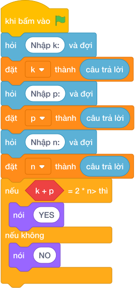

# Hướng Dẫn Giảng Dạy: Mario cứu công chúa
Chuyên đề: **Lập Trình Thuật Toán & Khối Lệnh Scratch 3.0**

---

## 1. Ý tưởng & Phân tích thuật toán
- Bản chất của bài này rất gọn: bài mẫu cộng tổng năng lượng `k + p` rồi so với quãng đường `2 * n`. Đủ sức đi hết quãng đường thì gặp nhau.
- Cách làm của lời giải mẫu: đọc `k`, `p`, `n` mỗi số một dòng, nếu `k + p >= 2 * n` thì in `YES`, ngược lại in `NO`. Với mẫu `k = 3, p = 3, n = 2`: `3 + 3 = 6`, `2 * n = 4`, vì `6 >= 4` nên in `YES`.
- Xử lý biên: ràng buộc `1 <= K, P, N <= 1000`. Thầy cô cho thử `k = 1, p = 1, n = 2` thì `1 + 1 = 2 < 4` nên in `NO`.

---

## 2. Bảng chạy tay trên số liệu mẫu (Dry Run Table - Sample 1: 3 rồi 3 rồi 2)
Sample 1 với input mẫu: `3` rồi `3` rồi `2`.
| Bước | Việc làm | Giá trị các biến | In ra |
|---|---|---|---|
| 1 | Đọc dòng một | `k = 3` | — |
| 2 | Đọc dòng hai | `p = 3` | — |
| 3 | Đọc dòng ba | `n = 2` | — |
| 4 | Tính `k + p = 6`, `2 * n = 4`; `6 >= 4` đúng | rẽ nhánh `if` | — |
| 5 | In kết quả | — | `YES` |

---

## 3. Lưu ý & Bẫy lỗi thường gặp
- Bẫy 1 — quên nhân đôi: bạn nhỏ viết `if k + p >= n`. Với `k = 1, p = 1, n = 2` sẽ tính `2 >= 2` rồi in `YES`, sai vì quãng đường thật là `4`. Cách sửa: so với `2 * n`.
- Bẫy 2 — đọc ba số trên một dòng mà không tách: nếu chỉ gọi `int(câu trả lời)` một lần cho input `3 3 2` thì chương trình lỗi. Cách sửa: đọc ba dòng như lời giải mẫu.
- Bẫy 3 — in chữ thường `yes`: bạn nhỏ in `yes`. Với mẫu trên, chương trình kiểm tra sẽ báo kết quả sai. Cách sửa: in đúng `YES` và `NO` viết hoa toàn bộ.

---

## 4. Lời giải tham khảo & Kịch bản Khối lệnh Scratch 3.0

### 4.1. Khối lệnh đồ họa trực quan (Visual Scratch Blocks)

> 💡 **Kịch bản thực hiện từng bước:**
> - khi bấm vào cờ xanh
> - hỏi [Nhập k:] và đợi
> - đặt [k] thành (câu trả lời)
> - hỏi [Nhập p:] và đợi
> - đặt [p] thành (câu trả lời)
> - hỏi [Nhập n:] và đợi
> - đặt [n] thành (câu trả lời)
> - nếu <k + p >= 2 * n> thì:
> -   nói [YES]
> - nếu không thì:
> -   nói [NO]
