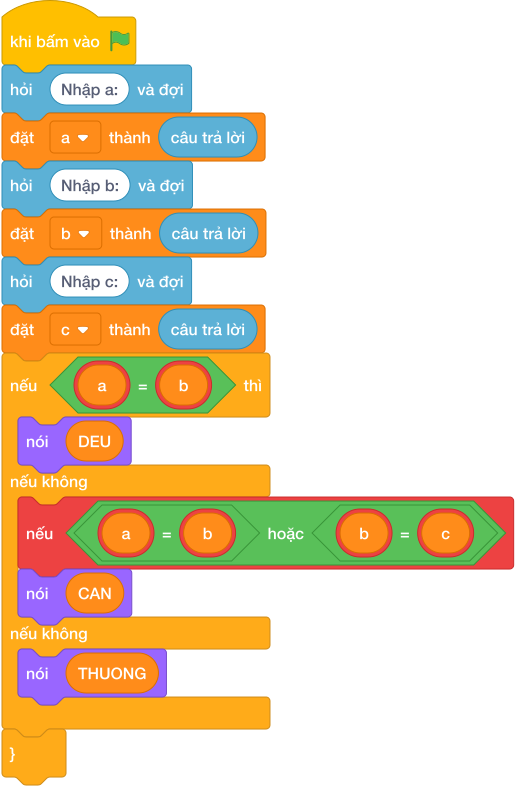

# Hướng Dẫn Giảng Dạy

## 1. Ý tưởng & Phân tích thuật toán
- Bản chất của bài này là đếm cạnh bằng nhau: ba cạnh `a, b, c` bằng nhau hết là tam giác đều, có đúng hai cạnh bằng nhau là tam giác cân, còn lại là tam giác thường.
- Cách làm của lời giải mẫu: đọc một dòng ba số `a, b, c`; nếu `a == b == c` in `DEU`, nếu `a == b or b == c or a == c` in `CAN`, còn lại in `THUONG`. Với mẫu `3 3 3`: `3 == 3 == 3` đúng nên in `DEU`.
- Xử lý biên: thầy cô cho thử `a = 3, b = 3, c = 4` (hai cạnh bằng nhau, in `CAN`) và `a = 3, b = 4, c = 5` (không cạnh nào bằng nhau, in `THUONG`).

---

## 2. Bảng chạy tay trên số liệu mẫu (Dry Run Table - Sample 1: 3 3 3)
Sample 1 với input mẫu: `3 3 3`.
| Bước | Việc làm | Giá trị các biến | In ra |
|---|---|---|---|
| 1 | Đọc một dòng, tách ba số | `a = 3, b = 3, c = 3` | — |
| 2 | Kiểm tra `3 == 3 == 3`? Đúng | rẽ nhánh một | — |
| 3 | In kết quả | — | `DEU` |

---

## 3. Lưu ý & Bẫy lỗi thường gặp
- Bẫy 1 — kiểm tra cân trước đều: bạn nhỏ viết `if a == b or ...` trước. Với mẫu `3 3 3` sẽ rơi ngay nhánh cân, in `CAN`, sai. Cách sửa: kiểm tra đều `a == b == c` trước như lời giải mẫu.
- Bẫy 2 — in đủ chữ `TAM GIAC DEU` theo đề: đề ghi `TAM GIAC DEU` nhưng lời giải mẫu in gọn `DEU`. Với mẫu `3 3 3`, nếu in dài sẽ không khớp chương trình kiểm tra hiện tại. Cách sửa: bám đúng lời giải mẫu, in `DEU`, `CAN`, `THUONG`.
- Bẫy 3 — đọc ba dòng mà không tách: nếu chỉ gọi `câu trả lời` ba lần cho input `3 3 3` trên một dòng thì lỗi. Cách sửa: tách một dòng bằng `các khối hỏi và đợi cho từng biến` như lời giải mẫu.

---

## 4. Lời giải tham khảo & Kịch bản Khối lệnh Scratch 3.0

### 4.1. Khối lệnh đồ họa trực quan (Visual Scratch Blocks)

> 💡 **Kịch bản thực hiện từng bước:**
> - khi bấm vào cờ xanh
> - hỏi [Nhập a:] và đợi
> - đặt [a] thành (câu trả lời)
> - hỏi [Nhập b:] và đợi
> - đặt [b] thành (câu trả lời)
> - hỏi [Nhập c:] và đợi
> - đặt [c] thành (câu trả lời)
> - nếu <a = b> thì:
> -   nói (DEU)
> - nếu không thì:
> -   nếu <điều kiện> thì:
> -     nói (CAN)
> -   nếu không thì:
> -     nói (THUONG)
