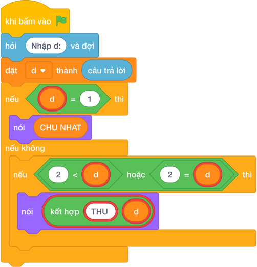

# Hướng Dẫn Giảng Dạy

## 1. Ý tưởng & Phân tích thuật toán
- Thầy cô lưu ý: đề bài kể ngày thứ `K` từ `1` tới `365` ứng với các chuỗi `THU HAI...`, nhưng lời giải mẫu của lớp mình đọc `d` rồi: `d == 1` in `CHU NHAT`, `2 <= d <= 7` in `THU {d}`. Khi dạy cần bám đúng lời giải mẫu này.
- Cách làm của lời giải mẫu: đọc `d`, rẽ hai nhánh như trên. Với mẫu `d = 2`: `2 == 1` sai, `2 <= 2 <= 7` đúng nên in `THU 2`.
- Xử lý biên: mốc cần thử là `d = 1` (in `CHU NHAT`) và `d = 7` (in `THU 7`).

---

## 2. Bảng chạy tay trên số liệu mẫu (Dry Run Table - Sample 1: 2)
Sample 1 với input mẫu: `2`.
| Bước | Việc làm | Giá trị của `d` | In ra |
|---|---|---|---|
| 1 | Đọc input | `d = 2` | — |
| 2 | Kiểm tra `2 == 1`? Sai | xuống nhánh `elif` | — |
| 3 | Kiểm tra `2 <= 2 <= 7`? Đúng | rẽ nhánh hai | — |
| 4 | In `THU 2` | — | `THU 2` |

---

## 3. Lưu ý & Bẫy lỗi thường gặp
- Bẫy 1 — in `THU HAI` theo lời kể trong đề: bạn nhỏ viết `nói ("THU HAI")` cho `d = 2`. Với mẫu `2`, chương trình kiểm tra của lớp mình chờ `THU 2` nên sẽ báo kết quả sai. Cách sửa: bám đúng lời giải mẫu, in `THU {d}`.
- Bẫy 2 — quên nhánh `d = 1`: bạn nhỏ chỉ viết nhánh `2 <= d <= 7`. Với `d = 1` sẽ không in gì. Cách sửa: giữ nhánh `if d == 1` in `CHU NHAT`.
- Bẫy 3 — dùng vòng lặp tuần cho `K` tới `365` theo đề: bạn nhỏ tính `(K - 1) % 7`. Với mẫu `2` cách đó cho thứ Ba, lệch khỏi lời giải mẫu. Cách sửa: dạy đúng hai nhánh của lời giải mẫu.

---

## 4. Lời giải tham khảo & Kịch bản Khối lệnh Scratch 3.0

### 4.1. Khối lệnh đồ họa trực quan (Visual Scratch Blocks)

> 💡 **Kịch bản thực hiện từng bước:**
> - khi bấm vào cờ xanh
> - hỏi [Nhập d:] và đợi
> - đặt [d] thành (câu trả lời)
> - nếu <d = 1> thì:
> -   nói (CHU NHAT)
> - nếu không thì:
> -   nếu <2 <= d> thì:
> -     nói (giá trị)
