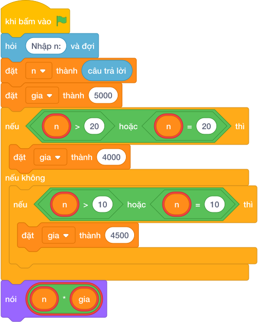

# Hướng Dẫn Giảng Dạy

## 1. Ý tưởng & Phân tích thuật toán
- Thầy cô lưu ý: đề bài kể ba mức giá `5, 4, 3` nghìn, nhưng lời giải mẫu của lớp mình dùng hai mốc `20` và `10`: `n >= 20` giá `4000`, `n >= 10` giá `4500`, còn lại giá `5000`, rồi in `n * gia`. Khi dạy cần bám đúng lời giải mẫu này.
- Cách làm của lời giải mẫu: đọc `n`, gán `gia = 5000` rồi chỉnh theo mốc. Với mẫu `n = 25`: `25 >= 20` đúng nên `gia = 4000`, in `25 * 4000 = 100000`.
- Xử lý biên: hai mốc cần thử là `n = 10` (giá `4500`, trả `45000`) và `n = 20` (giá `4000`, trả `80000`).

---

## 2. Bảng chạy tay trên số liệu mẫu (Dry Run Table - Sample 1: 25)
Sample 1 với input mẫu: `25`.
| Bước | Việc làm | Giá trị các biến | In ra |
|---|---|---|---|
| 1 | Đọc input | `n = 25` | — |
| 2 | Gán mặc định | `gia = 5000` | — |
| 3 | Kiểm tra `25 >= 20`? Đúng | `gia = 4000` | — |
| 4 | Tính `25 * 4000 = 100000` rồi in | — | `100000` |

---

## 3. Lưu ý & Bẫy lỗi thường gặp
- Bẫy 1 — đảo thứ tự mốc: bạn nhỏ viết `if n >= 10` trước rồi `elif n >= 20`. Với mẫu `25` sẽ dính ngay mốc `10`, `gia = 4500`, in `112500`, sai. Cách sửa: kiểm tra mốc lớn `20` trước như lời giải mẫu.
- Bẫy 2 — quên nhân số lượng: bạn nhỏ viết `nói (gia)`. Với mẫu `25` sẽ in `4000` thay vì `100000`. Cách sửa: in `n * gia`.
- Bẫy 3 — dùng mốc `50` theo lời kể trong đề: bạn nhỏ viết `if n >= 50`. Với mẫu `25` sẽ không giảm giá, in `125000`, lệch khỏi lời giải mẫu. Cách sửa: bám đúng hai mốc `20` và `10` của lời giải mẫu.

---

## 4. Lời giải tham khảo & Kịch bản Khối lệnh Scratch 3.0

### 4.1. Khối lệnh đồ họa trực quan (Visual Scratch Blocks)

> 💡 **Kịch bản thực hiện từng bước:**
> - khi bấm vào cờ xanh
> - hỏi [Nhập n:] và đợi
> - đặt [n] thành (câu trả lời)
> - đặt [gia] thành (5000)
> - nếu <n >= 20> thì:
> -   đặt [gia] thành (4000)
> - nếu không thì:
> -   nếu <n >= 10> thì:
> -     đặt [gia] thành (4500)
> - nói (n * gia)
