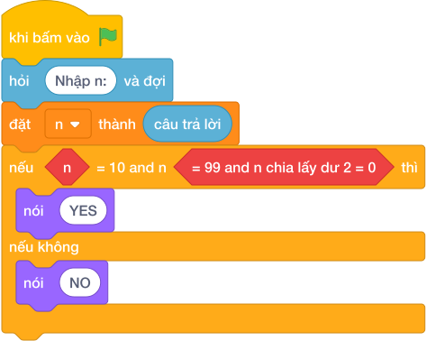

# Hướng Dẫn Giảng Dạy: Số chẵn có hai chữ số
Chuyên đề: **Lập Trình Thuật Toán & Khối Lệnh Scratch 3.0**

---

## 1. Ý tưởng & Phân tích thuật toán
- Bản chất của bài này là hai điều kiện phải đúng cùng lúc: `n` nằm từ `10` tới `99` (đúng hai chữ số) và `n % 2 == 0` (số chẵn).
- Cách làm của lời giải mẫu: kiểm tra `if n >= 10 and n <= 99 and n % 2 == 0` thì in `YES`, ngược lại in `NO`. Với mẫu `n = 24`: `24 >= 10` đúng, `24 <= 99` đúng, `24 % 2 == 0` đúng nên in `YES`.
- Xử lý biên: ràng buộc `1 <= N <= 1000`. Các mốc cần thử là `n = 8` (chẵn nhưng một chữ số, in `NO`), `n = 35` (hai chữ số nhưng lẻ, in `NO`), `n = 100` (ba chữ số, in `NO`).

---

## 2. Bảng chạy tay trên số liệu mẫu (Dry Run Table - Sample 1: 24)
Sample 1 với input mẫu: `24`.
| Bước | Việc làm | Giá trị của `n` | In ra |
|---|---|---|---|
| 1 | Đọc input | `n = 24` | — |
| 2 | Kiểm tra `24 >= 10`? Đúng | tiếp tục | — |
| 3 | Kiểm tra `24 <= 99`? Đúng | tiếp tục | — |
| 4 | Kiểm tra `24 % 2 == 0`? Đúng, cả ba đúng | rẽ nhánh `if` | — |
| 5 | In kết quả | — | `YES` |

---

## 3. Lưu ý & Bẫy lỗi thường gặp
- Bẫy 1 — dùng `or` thay vì `and`: bạn nhỏ viết `if n >= 10 or n % 2 == 0`. Với `n = 8` (một chữ số nhưng chẵn) sẽ in `YES`, sai. Cách sửa: nối ba điều kiện bằng `and`.
- Bẫy 2 — quên chặn trên `99`: bạn nhỏ viết `if n >= 10 and n % 2 == 0`. Với `n = 100` sẽ in `YES`, sai vì ba chữ số. Cách sửa: thêm `n <= 99`.
- Bẫy 3 — in `Yes` sai chữ hoa: bạn nhỏ in `Yes` hoặc `yes`. Với mẫu `24`, chương trình kiểm tra sẽ báo kết quả sai. Cách sửa: in đúng `YES` và `NO` viết hoa toàn bộ.

---

## 4. Lời giải tham khảo & Kịch bản Khối lệnh Scratch 3.0

### 4.1. Khối lệnh đồ họa trực quan (Visual Scratch Blocks)

> 💡 **Kịch bản thực hiện từng bước:**
> - khi bấm vào cờ xanh
> - hỏi [Nhập n:] và đợi
> - đặt [n] thành (câu trả lời)
> - nếu <n >= 10 and n <= 99 and n  chia lấy dư  2 = 0> thì:
> -   nói [YES]
> - nếu không thì:
> -   nói [NO]
