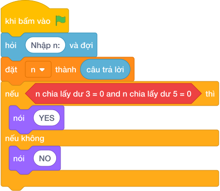

# Hướng Dẫn Giảng Dạy: Bội chung của 3 và 5
Chuyên đề: **Lập Trình Thuật Toán & Khối Lệnh Scratch 3.0**

---

## 1. Ý tưởng & Phân tích thuật toán
- Bản chất của bài này là số `n` phải chia hết cho cả `3` và `5` cùng lúc, tức `n % 3 == 0` và `n % 5 == 0`.
- Cách làm của lời giải mẫu: đọc `n`, nếu cả hai điều kiện đúng thì in `YES`, ngược lại in `NO`. Với mẫu `n = 15`: `15 % 3 = 0` đúng và `15 % 5 = 0` đúng nên in `YES`.
- Xử lý biên: ràng buộc `1 <= N <= 10^9`. Thầy cô cho thử `n = 9` (chỉ chia hết cho `3`) và `n = 10` (chỉ chia hết cho `5`), cả hai đều in `NO`.

---

## 2. Bảng chạy tay trên số liệu mẫu (Dry Run Table - Sample 1: 15)
Sample 1 với input mẫu: `15`.
| Bước | Việc làm | Giá trị của `n` | In ra |
|---|---|---|---|
| 1 | Đọc input | `n = 15` | — |
| 2 | Kiểm tra `15 % 3 == 0`? Đúng | tiếp tục | — |
| 3 | Kiểm tra `15 % 5 == 0`? Đúng, cả hai đúng | rẽ nhánh `if` | — |
| 4 | In kết quả | — | `YES` |

---

## 3. Lưu ý & Bẫy lỗi thường gặp
- Bẫy 1 — dùng `or` thay vì `and`: bạn nhỏ viết `if n % 3 == 0 or n % 5 == 0`. Với `n = 9` sẽ in `YES`, sai vì `9` không chia hết cho `5`. Cách sửa: nối hai điều kiện bằng `and`.
- Bẫy 2 — in `FIZZBUZZ` theo đề mà lệch lời giải mẫu: đề ghi `FIZZBUZZ` nhưng lời giải mẫu của lớp mình in `YES`. Với mẫu `15`, nếu in `FIZZBUZZ` sẽ không khớp chương trình kiểm tra hiện tại. Cách sửa: bám đúng lời giải mẫu, in `YES` và `NO`.
- Bẫy 3 — kiểm tra chia hết bằng chia thường: bạn nhỏ viết `if n / 3 == 0`. Với mọi `n` dương, `n / 3` khác `0` nên luôn in `NO`. Cách sửa: dùng phép chia dư `%`.

---

## 4. Lời giải tham khảo & Kịch bản Khối lệnh Scratch 3.0

### 4.1. Khối lệnh đồ họa trực quan (Visual Scratch Blocks)

> 💡 **Kịch bản thực hiện từng bước:**
> - khi bấm vào cờ xanh
> - hỏi [Nhập n:] và đợi
> - đặt [n] thành (câu trả lời)
> - nếu <n  chia lấy dư  3 = 0 and n  chia lấy dư  5 = 0> thì:
> -   nói [YES]
> - nếu không thì:
> -   nói [NO]
