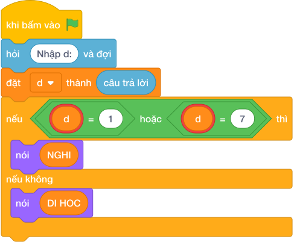

# Hướng Dẫn Giảng Dạy

## 1. Ý tưởng & Phân tích thuật toán
- Bản chất của bài này là nhận diện đúng các số ngày nghỉ trong lời giải mẫu: biến `d` bằng `1` hoặc bằng `7` thì in `NGHI`, các số còn lại in `DI HOC`.
- Cách làm của lời giải mẫu: đọc `d`, kiểm tra `if d == 1 or d == 7`. Với mẫu `d = 7`, điều kiện đúng nên in `NGHI`.
- Xử lý biên: ràng buộc ghi `2 <= d <= 8`. Thầy cô lưu ý lời giải mẫu dùng mốc `1` và `7`, còn đề bài kể chuyện các số `7` (Thứ Bảy) và `8` (Chủ Nhật), nên khi dạy cần đối chiếu với chương trình kiểm tra của lớp mình.

---

## 2. Bảng chạy tay trên số liệu mẫu (Dry Run Table - Sample 1: 7)
Sample 1 với input mẫu: `7`.
| Bước | Việc làm | Giá trị của `d` | In ra |
|---|---|---|---|
| 1 | Đọc input | `d = 7` | — |
| 2 | Kiểm tra `d == 1`? Sai; `d == 7`? Đúng | điều kiện `or` đúng | — |
| 3 | In theo nhánh đúng | — | `NGHI` |

---

## 3. Lưu ý & Bẫy lỗi thường gặp
- Bẫy 1 — chỉ kiểm tra một ngày: bạn nhỏ viết `if d == 7`. Với `d = 1` sẽ in `DI HOC`, không khớp lời giải mẫu. Cách sửa: giữ đủ `if d == 1 or d == 7`.
- Bẫy 2 — viết `and` thay vì `or`: bạn nhỏ viết `if d == 1 and d == 7`. Một số không thể vừa bằng `1` vừa bằng `7` nên nhánh này không bao giờ đúng, mẫu `7` sẽ in `DI HOC`, sai. Cách sửa: dùng `or`.
- Bẫy 3 — in sai chữ: bạn nhỏ in `NGHI HOC` trong khi lời giải mẫu in `NGHI`. Với mẫu `7`, chương trình kiểm tra sẽ báo kết quả sai vì thừa chữ. Cách sửa: chép đúng từng chữ của lời giải mẫu.

---

## 4. Lời giải tham khảo & Kịch bản Khối lệnh Scratch 3.0

### 4.1. Khối lệnh đồ họa trực quan (Visual Scratch Blocks)

> 💡 **Kịch bản thực hiện từng bước:**
> - khi bấm vào cờ xanh
> - hỏi [Nhập d:] và đợi
> - đặt [d] thành (câu trả lời)
> - nếu <điều kiện> thì:
> -   nói (NGHI)
> - nếu không thì:
> -   nói (DI HOC)
