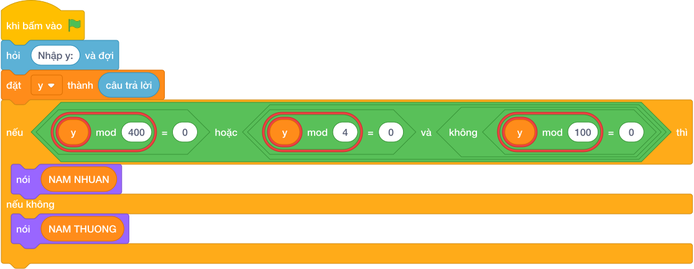

# Hướng Dẫn Giảng Dạy

## 1. Ý tưởng & Phân tích thuật toán
- Bản chất của bài này là quy tắc năm nhuận: chia hết cho `400` thì nhuận, hoặc chia hết cho `4` nhưng không chia hết cho `100` thì nhuận.
- Cách làm của lời giải mẫu: đọc `y`, kiểm tra `if (y mod 400) == 0 or ((y mod 4) == 0 and (y mod 100) != 0)` thì in `NAM NHUAN`, ngược lại in `NAM THUONG`. Với mẫu `y = 2024`: `(2024 mod 400) = 24` sai, nhưng `(2024 mod 4) = 0` đúng và `(2024 mod 100) = 24` khác `0` đúng nên cả cụm đúng, in `NAM NHUAN`.
- Xử lý biên: ràng buộc `1 <= Y <= 10^5`. Hai mốc thầy cô nên thử là `y = 1900` (chia hết cho `100` nhưng không chia hết cho `400`, in `NAM THUONG`) và `y = 2000` (chia hết cho `400`, in `NAM NHUAN`).

---

## 2. Bảng chạy tay trên số liệu mẫu (Dry Run Table - Sample 1: 2024)
Sample 1 với input mẫu: `2024`.
| Bước | Việc làm | Giá trị của `y` | In ra |
|---|---|---|---|
| 1 | Đọc input | `y = 2024` | — |
| 2 | Kiểm tra `(2024 mod 400) == 0`? `24 == 0` sai | xét vế sau | — |
| 3 | Kiểm tra `(2024 mod 4) == 0`? Đúng; `(2024 mod 100) != 0`? `24 != 0` đúng | cả cụm đúng | — |
| 4 | In kết quả | — | `NAM NHUAN` |

---

## 3. Lưu ý & Bẫy lỗi thường gặp
- Bẫy 1 — chỉ kiểm tra chia hết cho `4`: bạn nhỏ viết `if (y mod 4) == 0`. Với `y = 1900` (`(1900 mod 4) = 0`) sẽ in `NAM NHUAN`, sai. Cách sửa: thêm điều kiện loại trừ `(y mod 100) != 0` như lời giải mẫu.
- Bẫy 2 — quên ngoặc khi nối `or` và `and`: bạn nhỏ viết `(y mod 400) == 0 or (y mod 4) == 0 and (y mod 100) != 0` mà không hiểu thứ tự, có bạn còn viết `if (y mod 400) == 0 and (y mod 4) == 0`. Với `y = 2024` sẽ sai vì `(2024 mod 400) != 0`. Cách sửa: giữ đúng công thức `(y mod 400) == 0 or ((y mod 4) == 0 and (y mod 100) != 0)`.
- Bẫy 3 — in sai chữ: bạn nhỏ in `Nam Nhuan` viết hoa chữ đầu. Với mẫu `2024`, chương trình kiểm tra sẽ báo kết quả sai. Cách sửa: in đúng `NAM NHUAN` và `NAM THUONG` viết hoa toàn bộ.

---

## 4. Lời giải tham khảo & Kịch bản Khối lệnh Scratch 3.0

### 4.1. Khối lệnh đồ họa trực quan (Visual Scratch Blocks)

> 💡 **Kịch bản thực hiện từng bước:**
> - khi bấm vào cờ xanh
> - hỏi [Nhập y:] và đợi
> - đặt [y] thành (câu trả lời)
> - nếu <điều kiện> thì:
> -   nói (NAM NHUAN)
> - nếu không thì:
> -   nói (NAM THUONG)
