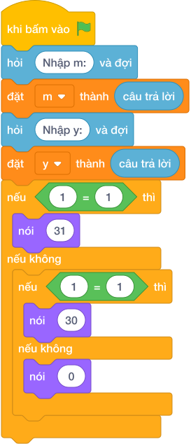

# Hướng Dẫn Giảng Dạy

## 1. Ý tưởng & Phân tích thuật toán
- Bản chất của bài này là tra lịch: các tháng `1, 3, 5, 7, 8, 10, 12` có `31` ngày; các tháng `4, 6, 9, 11` có `30` ngày; tháng `2` có `29` ngày nếu năm nhuận, `28` ngày nếu năm thường.
- Cách làm của lời giải mẫu: đọc `m` rồi đọc `y`, rẽ nhánh theo nhóm tháng kể trên; riêng tháng `2` kiểm tra `(y mod 400) == 0 or ((y mod 4) == 0 and (y mod 100) != 0)`. Với mẫu `m = 2, y = 2024`: `2024` nhuận nên in `29`.
- Xử lý biên: thầy cô cho thử `m = 2, y = 2023` (năm thường, in `28`) và `m = 4, y = 2025` (tháng `30` ngày, in `30`).

---

## 2. Bảng chạy tay trên số liệu mẫu (Dry Run Table - Sample 1: 2 rồi 2024)
Sample 1 với input mẫu: `2` rồi `2024`.
| Bước | Việc làm | Giá trị các biến | In ra |
|---|---|---|---|
| 1 | Đọc dòng một | `m = 2` | — |
| 2 | Đọc dòng hai | `y = 2024` | — |
| 3 | `m` có trong nhóm `31` ngày? Không; nhóm `30` ngày? Không | xuống nhánh tháng `2` | — |
| 4 | Kiểm tra `2024` nhuận? Chia hết cho `4`, không chia hết cho `100` nên đúng | chọn `29` | — |
| 5 | In kết quả | — | `29` |

---

## 3. Lưu ý & Bẫy lỗi thường gặp
- Bẫy 1 — tháng `2` luôn `28` ngày: bạn nhỏ viết `nói (28)` cho mọi năm. Với mẫu `2` và `2024` sẽ in `28` thay vì `29`. Cách sửa: kiểm tra năm nhuận như lời giải mẫu.
- Bẫy 2 — nhớ sai nhóm tháng: bạn nhỏ cho tháng `8` vào nhóm `30` ngày. Với `m = 8` sẽ in `30` thay vì `31`. Cách sửa: giữ đúng hai danh sách `[1, 3, 5, 7, 8, 10, 12]` và `[4, 6, 9, 11]`.
- Bẫy 3 — kiểm tra nhuận chỉ bằng `(y mod 4) == 0`: với `y = 1900` sẽ cho nhuận sai. Cách sửa: dùng đủ công thức `(y mod 400) == 0 or ((y mod 4) == 0 and (y mod 100) != 0)`.

---

## 4. Lời giải tham khảo & Kịch bản Khối lệnh Scratch 3.0

### 4.1. Khối lệnh đồ họa trực quan (Visual Scratch Blocks)

> 💡 **Kịch bản thực hiện từng bước:**
> - khi bấm vào cờ xanh
> - hỏi [Nhập m:] và đợi
> - đặt [m] thành (câu trả lời)
> - hỏi [Nhập y:] và đợi
> - đặt [y] thành (câu trả lời)
> - nếu <m = giá trị> thì:
> -   nói (31)
> - nếu không thì:
> -   nếu <m = giá trị> thì:
> -     nói (30)
> -   nếu không thì:
> -     nói (giá trị)
