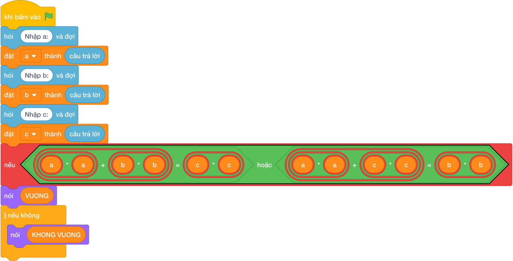

# Hướng Dẫn Giảng Dạy

## 1. Ý tưởng & Phân tích thuật toán
- Bản chất của bài này là kiểm tra đẳng thức bình phương ba cạnh: `a * a + b * b == c * c` hoặc `a * a + c * c == b * b` hoặc `b * b + c * c == a * a`, đúng một vế là vuông.
- Cách làm của lời giải mẫu: đọc `a, b, c` linh hoạt cả hai kiểu input rồi kiểm tra cả ba vế nối bằng `or`. Với mẫu `3, 4, 5`: `3*3 + 4*4 = 25`, `5*5 = 25`, vế một đúng nên in `VUONG`.
- Xử lý biên: ràng buộc `1 <= a, b, c <= 10^4`, bình phương lên tới `10^8` vẫn vừa số nguyên. Thầy cô cho thử `a = 3, b = 4, c = 6` (`9 + 16 = 25` khác `36`, cả ba vế sai, in `KHONG VUONG`).

---

## 2. Bảng chạy tay trên số liệu mẫu (Dry Run Table - Sample 1: 3 rồi 4 rồi 5)
Sample 1 với input mẫu: `3` rồi `4` rồi `5`.
| Bước | Việc làm | Giá trị các biến | In ra |
|---|---|---|---|
| 1 | Đọc các số | `a = 3, b = 4, c = 5` | — |
| 2 | Tính `3*3 + 4*4 = 25`, `5*5 = 25`; `25 == 25` đúng | cả cụm `or` đúng | — |
| 3 | In kết quả | — | `VUONG` |

---

## 3. Lưu ý & Bẫy lỗi thường gặp
- Bẫy 1 — chỉ kiểm tra một vế: bạn nhỏ viết `if a * a + b * b == c * c`. Với `a = 5, b = 3, c = 4` (cạnh huyền nằm ở `a`) sẽ in `KHONG VUONG`, sai. Cách sửa: giữ đủ ba vế nối bằng `or`.
- Bẫy 2 — dùng căn bậc hai: bạn nhỏ tính `c == (a*a + b*b) ** 0.5` rồi so số thực. Với số lớn dễ lệch dấu chấm động. Cách sửa: so bình phương nguyên như lời giải mẫu.
- Bẫy 3 — quên số mũ: bạn nhỏ viết `a + b == c`. Với mẫu `3, 4, 5` thì `7 == 5` sai nên in `KHONG VUONG`, sai. Cách sửa: nhân mỗi cạnh với chính nó trước khi cộng.

---

## 4. Lời giải tham khảo & Kịch bản Khối lệnh Scratch 3.0

### 4.1. Khối lệnh đồ họa trực quan (Visual Scratch Blocks)

> 💡 **Kịch bản thực hiện từng bước:**
> - khi bấm vào cờ xanh
> - hỏi [Nhập a:] và đợi
> - đặt [a] thành (câu trả lời)
> - hỏi [Nhập b:] và đợi
> - đặt [b] thành (câu trả lời)
> - hỏi [Nhập c:] và đợi
> - đặt [c] thành (câu trả lời)
> - nếu <điều kiện> thì:
> -   nói (VUONG)
> - nếu không thì:
> -   nói (KHONG VUONG)
