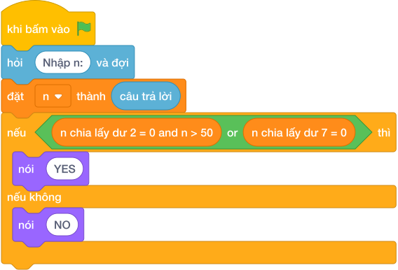

# Hướng Dẫn Giảng Dạy: Rút thẻ may mắn
Chuyên đề: **Lập Trình Thuật Toán & Khối Lệnh Scratch 3.0**

---

## 1. Ý tưởng & Phân tích thuật toán
- Thầy cô lưu ý: đề bài kể thẻ trúng khi `n` chia hết cho `7` hoặc tận cùng là `7`, nhưng lời giải mẫu của lớp mình trúng khi `(n % 2 == 0 and n > 50) or (n % 7 == 0)`. Khi dạy cần bám đúng lời giải mẫu này.
- Cách làm của lời giải mẫu: đọc `n`, nếu `(n % 2 == 0 and n > 50) or (n % 7 == 0)` thì in `TRUNG THUONG`, ngược lại in `CHUC MAY MAN`. Với mẫu `n = 14`: `14 % 7 = 0` đúng nên cả cụm đúng, in `TRUNG THUONG`.
- Xử lý biên: ràng buộc `1 <= N <= 10^9`. Thầy cô cho thử `n = 52` (chẵn và lớn hơn `50`, trúng) và `n = 27` (tận cùng `7` nhưng không chia hết cho `7` và là số lẻ, theo lời giải mẫu này in `CHUC MAY MAN`).

---

## 2. Bảng chạy tay trên số liệu mẫu (Dry Run Table - Sample 1: 14)
Sample 1 với input mẫu: `14`.
| Bước | Việc làm | Giá trị của `n` | In ra |
|---|---|---|---|
| 1 | Đọc input | `n = 14` | — |
| 2 | Kiểm tra `14 % 2 == 0 and 14 > 50`? `14 > 50` sai nên vế này sai | xét vế sau | — |
| 3 | Kiểm tra `14 % 7 == 0`? Đúng, cả cụm `or` đúng | rẽ nhánh `if` | — |
| 4 | In kết quả | — | `TRUNG THUONG` |

---

## 3. Lưu ý & Bẫy lỗi thường gặp
- Bẫy 1 — chỉ kiểm tra chia hết cho `7`: bạn nhỏ viết `if n % 7 == 0`. Với `n = 52` sẽ in `CHUC MAY MAN`, lệch khỏi lời giải mẫu (mẫu cho trúng). Cách sửa: giữ đủ công thức `(n % 2 == 0 and n > 50) or (n % 7 == 0)`.
- Bẫy 2 — kiểm tra tận cùng là `7` theo lời kể trong đề: bạn nhỏ viết `if n % 10 == 7`. Với `n = 27` sẽ in `TRUNG THUONG`, lệch khỏi lời giải mẫu. Cách sửa: dạy học sinh bám đúng lời giải mẫu của lớp.
- Bẫy 3 — in sai chữ: bạn nhỏ in `TRUNG THUONG` thiếu chữ hoặc in `CHUC MAY MAN LAN SAU` dài hơn mẫu. Với mẫu `14`, chương trình kiểm tra sẽ báo kết quả sai vì thừa thiếu chữ. Cách sửa: chép đúng `TRUNG THUONG` và `CHUC MAY MAN` của lời giải mẫu.

---

## 4. Lời giải tham khảo & Kịch bản Khối lệnh Scratch 3.0

### 4.1. Khối lệnh đồ họa trực quan (Visual Scratch Blocks)

> 💡 **Kịch bản thực hiện từng bước:**
> - khi bấm vào cờ xanh
> - hỏi [Nhập n:] và đợi
> - đặt [n] thành (câu trả lời)
> - nếu <(n  chia lấy dư  2 = 0 and n > 50) or (n  chia lấy dư  7 = 0)> thì:
> -   nói [YES]
> - nếu không thì:
> -   nói [NO]
