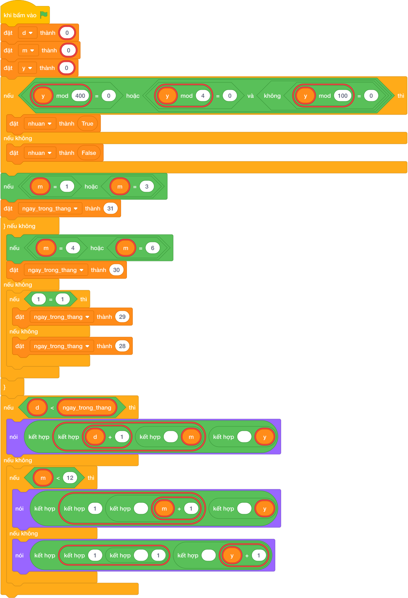

# Hướng Dẫn Giảng Dạy

## 1. Ý tưởng & Phân tích thuật toán
- Bản chất của bài này là lật sang ngày mai: biết tháng `m` có bao nhiêu ngày (`ngay_trong_thang`) rồi xét ba cửa: còn trong tháng thì `d + 1`, hết tháng nhưng còn trong năm thì sang `1` tháng sau, hết năm thì sang `1 1` năm sau.
- Cách làm của lời giải mẫu: đọc `d, m, y` mỗi số một dòng; tính `nhuan` cho năm `y`; tra `ngay_trong_thang` (`31` cho các tháng `1, 3, 5, 7, 8, 10, 12`; `30` cho `4, 6, 9, 11`; tháng `2` là `29` nếu nhuận, `28` nếu thường); rồi rẽ ba nhánh in. Với mẫu `31, 12, 2024`: tháng `12` có `31` ngày, `d` đã chạm mốc và `m` chạm `12` nên in `1 1 2025`.
- Xử lý biên: thầy cô cho thử `28, 2, 2024` (nhuận, tháng `2` có `29` ngày, `28 < 29` nên in `29 2 2024`) và `28, 2, 2023` (thường, tháng `2` có `28` ngày, hết tháng nên in `1 3 2023`).

---

## 2. Bảng chạy tay trên số liệu mẫu (Dry Run Table - Sample 1: 31 rồi 12 rồi 2024)
Sample 1 với input mẫu: `31` rồi `12` rồi `2024`.
| Bước | Việc làm | Giá trị các biến | In ra |
|---|---|---|---|
| 1 | Đọc ba dòng | `d = 31, m = 12, y = 2024` | — |
| 2 | Kiểm tra `2024` nhuận? Đúng | `nhuan = True` | — |
| 3 | Tháng `12` thuộc nhóm `31` ngày | `ngay_trong_thang = 31` | — |
| 4 | `31 < 31`? Sai; `12 < 12`? Sai | xuống nhánh cuối | — |
| 5 | In ngày đầu năm mới | — | `1 1 2025` |

---

## 3. Lưu ý & Bẫy lỗi thường gặp
- Bẫy 1 — tháng `2` luôn `28` ngày: bạn nhỏ viết `ngay_trong_thang = 28` cho mọi năm. Với `28, 2, 2024` sẽ in `1 3 2024` thay vì `29 2 2024`. Cách sửa: kiểm tra `nhuan` như lời giải mẫu.
- Bẫy 2 — quên cửa hết năm: bạn nhỏ chỉ viết `if d < ngay_trong_thang ... else nói (1, m + 1, y)`. Với mẫu `31, 12, 2024` sẽ in `1 13 2024`, sai. Cách sửa: giữ nhánh `elif m < 12` rồi mới `else` sang năm mới.
- Bẫy 3 — nhớ sai nhóm tháng: bạn nhỏ cho tháng `8` vào nhóm `30` ngày. Với `31, 8, 2024` sẽ tính sai mốc. Cách sửa: giữ đúng nhóm `31` ngày là `1, 3, 5, 7, 8, 10, 12`.

---

## 4. Lời giải tham khảo & Kịch bản Khối lệnh Scratch 3.0

### 4.1. Khối lệnh đồ họa trực quan (Visual Scratch Blocks)

> 💡 **Kịch bản thực hiện từng bước:**
> - khi bấm vào cờ xanh
> - đặt [d] thành (int(...))
> - đặt [m] thành (int(...))
> - đặt [y] thành (int(...))
> - nếu <điều kiện> thì:
> -   đặt [nhuan] thành (True)
> - nếu không thì:
> -   đặt [nhuan] thành (False)
> - nếu <điều kiện> thì:
> -   đặt [ngay_trong_thang] thành (31)
> - nếu không thì:
> -   nếu <điều kiện> thì:
> -     đặt [ngay_trong_thang] thành (30)
> -   nếu không thì:
> -     nếu <điều kiện> thì:
> -       đặt [ngay_trong_thang] thành (29)
> -     nếu không thì:
> -       đặt [ngay_trong_thang] thành (28)
> - nếu <d < ngay_trong_thang> thì:
> -   nói (kết hợp d + 1 và ' ' và m và ' ' và y)
> - nếu không thì:
> -   nếu <m < 12> thì:
> -     nói (kết hợp 1 và ' ' và m + 1 và ' ' và y)
> -   nếu không thì:
> -     nói (kết hợp 1 và ' ' và 1 và ' ' và y + 1)
