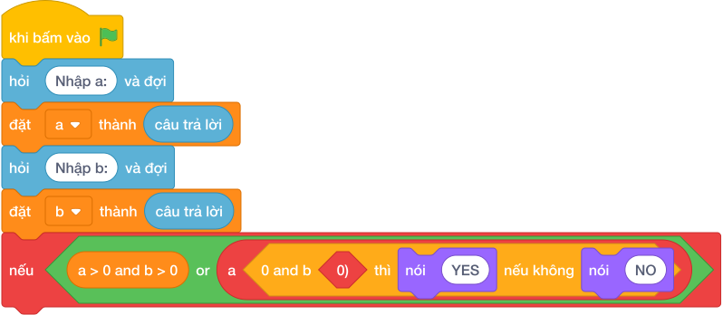

# Hướng Dẫn Giảng Dạy: Cặp đôi cùng dấu hay trái dấu
Chuyên đề: **Lập Trình Thuật Toán & Khối Lệnh Scratch 3.0**

---

## 1. Ý tưởng & Phân tích thuật toán
- Bản chất của bài này là nhìn dấu của hai số `a, b` đọc trên một dòng: có số `0` thì in `CO SO KHONG`, cùng dương hoặc cùng âm thì `CUNG DAU`, một dương một âm thì `TRAI DAU`.
- Cách làm của lời giải mẫu: tách `a, b = map(int, câu trả lời.split())` rồi kiểm tra `(a > 0 and b > 0) or (a < 0 and b < 0)` trước, sau đó kiểm tra trái dấu, cuối cùng là có số `0`. Với mẫu `5 10`: `5 > 0 and 10 > 0` đúng nên in `CUNG DAU`.
- Xử lý biên: ràng buộc `-10^9 <= a, b <= 10^9`. Thầy cô cho thử `a = 0, b = 5` (in `CO SO KHONG`) và `a = -3, b = 7` (in `TRAI DAU`).

---

## 2. Bảng chạy tay trên số liệu mẫu (Dry Run Table - Sample 1: 5 10)
Sample 1 với input mẫu: `5 10`.
| Bước | Việc làm | Giá trị các biến | In ra |
|---|---|---|---|
| 1 | Đọc một dòng, tách hai số | `a = 5, b = 10` | — |
| 2 | Kiểm tra `5 > 0 and 10 > 0`? Đúng | cả cụm `or` đúng | — |
| 3 | In kết quả | — | `CUNG DAU` |

---

## 3. Lưu ý & Bẫy lỗi thường gặp
- Bẫy 1 — nhân hai số để xét dấu: bạn nhỏ viết `if a * b > 0`. Với `a, b` tới `10^9`, tích lên tới `10^18` vẫn chạy được trong Scratch nhưng cách viết khó giảng cho bạn nhỏ, lại quên mất số `0`. Cách sửa: so dấu trực tiếp như lời giải mẫu.
- Bẫy 2 — kiểm tra số `0` sau cùng mà viết `else` sai: có bạn quên nhánh `CO SO KHONG`, với `a = 0, b = 5` sẽ in `TRAI DAU`, sai. Cách sửa: giữ nhánh cuối in `CO SO KHONG`.
- Bẫy 3 — đọc hai dòng mà không tách: nếu chỉ gọi `int(câu trả lời)` một lần cho input `5 10` thì lỗi. Cách sửa: tách một dòng bằng `map(int, câu trả lời.split())` như lời giải mẫu.

---

## 4. Lời giải tham khảo & Kịch bản Khối lệnh Scratch 3.0

### 4.1. Khối lệnh đồ họa trực quan (Visual Scratch Blocks)

> 💡 **Kịch bản thực hiện từng bước:**
> - khi bấm vào cờ xanh
> - hỏi [Nhập a:] và đợi
> - đặt [a] thành (câu trả lời)
> - hỏi [Nhập b:] và đợi
> - đặt [b] thành (câu trả lời)
> - nếu <(a > 0 and b > 0) or (a < 0 and b < 0)> thì:
> -   nói [YES]
> - nếu không thì:
> -   nói [NO]
