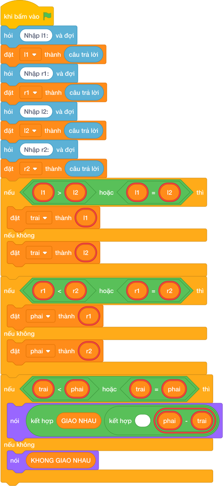

# Hướng Dẫn Giảng Dạy

## 1. Ý tưởng & Phân tích thuật toán
- Bản chất của bài này là tìm phần chồng lấn của hai đoạn `[l1, r1]` và `[l2, r2]`: mép trái của phần chung là `trai = max(l1, l2)`, mép phải là `phai = min(r1, r2)`; nếu `trai <= phai` thì giao nhau với độ dài `phai - trai`.
- Cách làm của lời giải mẫu: đọc bốn số linh hoạt cả hai kiểu input, tính `trai` bằng `if l1 >= l2` và `phai` bằng `if r1 <= r2`, rồi so sánh. Với mẫu `1, 6, 4, 9`: `trai = max(1, 4) = 4`, `phai = min(6, 9) = 6`; `4 <= 6` đúng nên in `GIAO NHAU 2`.
- Xử lý biên: ràng buộc cho phép tới `10^9` và âm tới `-10^9`. Thầy cô cho thử `1, 3, 5, 8`: `trai = 5`, `phai = 3`, `5 <= 3` sai nên in `KHONG GIAO NHAU`. Hai đoạn chạm nhau tại một điểm, ví dụ `1, 4, 4, 9`, vẫn là giao nhau với độ dài `0`.

---

## 2. Bảng chạy tay trên số liệu mẫu (Dry Run Table - Sample 1: 1 rồi 6 rồi 4 rồi 9)
Sample 1 với input mẫu: `1` rồi `6` rồi `4` rồi `9`.
| Bước | Việc làm | Giá trị các biến | In ra |
|---|---|---|---|
| 1 | Đọc bốn số | `l1 = 1, r1 = 6, l2 = 4, r2 = 9` | — |
| 2 | Tính mép trái: `1 >= 4`? Sai nên `trai = 4` | `trai = 4` | — |
| 3 | Tính mép phải: `6 <= 9`? Đúng nên `phai = 6` | `phai = 6` | — |
| 4 | Kiểm tra `4 <= 6`? Đúng | giao nhau | — |
| 5 | Tính `6 - 4 = 2` rồi in | — | `GIAO NHAU 2` |

---

## 3. Lưu ý & Bẫy lỗi thường gặp
- Bẫy 1 — lấy `min` cho mép trái: bạn nhỏ viết `trai = min(l1, l2)`. Với mẫu `1, 6, 4, 9` sẽ được `trai = 1`, `phai = 6`, in `GIAO NHAU 5`, sai. Cách sửa: mép trái lấy số lớn hơn (`max`), mép phải lấy số nhỏ hơn (`min`).
- Bẫy 2 — dùng `<` thay vì `<=`: bạn nhỏ viết `if trai < phai`. Với hai đoạn chạm nhau tại một điểm như `1, 4, 4, 9` sẽ in `KHONG GIAO NHAU`, sai vì đề tính cả điểm chung. Cách sửa: dùng `trai <= phai`.
- Bẫy 3 — đọc cứng bốn dòng: bạn nhỏ gọi `câu trả lời` bốn lần mà không tách. Với input `1 6 4 9` trên một dòng sẽ thiếu. Cách sửa: tách dòng đầu rồi mới đọc tiếp như lời giải mẫu.

---

## 4. Lời giải tham khảo & Kịch bản Khối lệnh Scratch 3.0

### 4.1. Khối lệnh đồ họa trực quan (Visual Scratch Blocks)

> 💡 **Kịch bản thực hiện từng bước:**
> - khi bấm vào cờ xanh
> - hỏi [Nhập l1:] và đợi
> - đặt [l1] thành (câu trả lời)
> - hỏi [Nhập r1:] và đợi
> - đặt [r1] thành (câu trả lời)
> - hỏi [Nhập l2:] và đợi
> - đặt [l2] thành (câu trả lời)
> - hỏi [Nhập r2:] và đợi
> - đặt [r2] thành (câu trả lời)
> - nếu <l1 >= l2> thì:
> -   đặt [trai] thành (l1)
> - nếu không thì:
> -   đặt [trai] thành (l2)
> - nếu <r1 <= r2> thì:
> -   đặt [phai] thành (r1)
> - nếu không thì:
> -   đặt [phai] thành (r2)
> - nếu <trai <= phai> thì:
> -   nói (kết hợp GIAO NHAU và ' ' và phai - trai)
> - nếu không thì:
> -   nói (KHONG GIAO NHAU)
