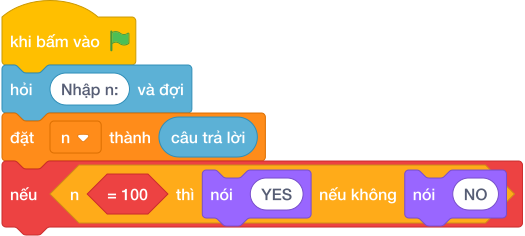

# Hướng Dẫn Giảng Dạy: Tiền điện bậc thang
Chuyên đề: **Lập Trình Thuật Toán & Khối Lệnh Scratch 3.0**

---

## 1. Ý tưởng & Phân tích thuật toán
- Bản chất của bài này là giá hai bậc: `100` số đầu mỗi số `2000` đồng, từ số thứ `101` trở đi mỗi số `3500` đồng.
- Cách làm của lời giải mẫu: đọc `n`, nếu `n <= 100` thì in `n * 2000`, ngược lại in `100 * 2000 + (n - 100) * 3500`. Với mẫu `n = 120`: `100 * 2000 = 200000`, `(120 - 100) * 3500 = 70000`, tổng `270000`.
- Xử lý biên: ràng buộc `1 <= N <= 10^6`. Hai mốc cần thử là `n = 100` (đúng mốc, trả `200000`) và `n = 101` (vượt một số, trả `203500`).

---

## 2. Bảng chạy tay trên số liệu mẫu (Dry Run Table - Sample 1: 120)
Sample 1 với input mẫu: `120`.
| Bước | Việc làm | Giá trị các biến | In ra |
|---|---|---|---|
| 1 | Đọc input | `n = 120` | — |
| 2 | Kiểm tra `120 <= 100`? Sai | rẽ nhánh `else` | — |
| 3 | Tính `100 * 2000 = 200000` | phần đầu `200000` | — |
| 4 | Tính `(120 - 100) * 3500 = 70000` | phần vượt `70000` | — |
| 5 | Cộng `200000 + 70000 = 270000` rồi in | — | `270000` |

---

## 3. Lưu ý & Bẫy lỗi thường gặp
- Bẫy 1 — tính cả `120` số giá cao: bạn nhỏ viết `nói (n * 3500)`. Với mẫu `120` sẽ in `420000` thay vì `270000`. Cách sửa: giữ `100` số đầu giá `2000` như lời giải mẫu.
- Bẫy 2 — quên trừ `100`: bạn nhỏ viết `100 * 2000 + n * 3500`. Với mẫu `120` sẽ in `620000`, sai. Cách sửa: chỉ nhân giá cao với `(n - 100)`.
- Bẫy 3 — nhầm mốc `101`: bạn nhỏ viết `if n < 100`. Với `n = 100` sẽ rơi sang nhánh vượt mốc, tính `200000 + 0 = 200000` thì vẫn đúng số nhưng cách viết dễ sai ở mốc khác. Cách sửa: dùng `if n <= 100` như lời giải mẫu.

---

## 4. Lời giải tham khảo & Kịch bản Khối lệnh Scratch 3.0

### 4.1. Khối lệnh đồ họa trực quan (Visual Scratch Blocks)

> 💡 **Kịch bản thực hiện từng bước:**
> - khi bấm vào cờ xanh
> - hỏi [Nhập n:] và đợi
> - đặt [n] thành (câu trả lời)
> - nếu <n <= 100> thì:
> -   nói [YES]
> - nếu không thì:
> -   nói [NO]
