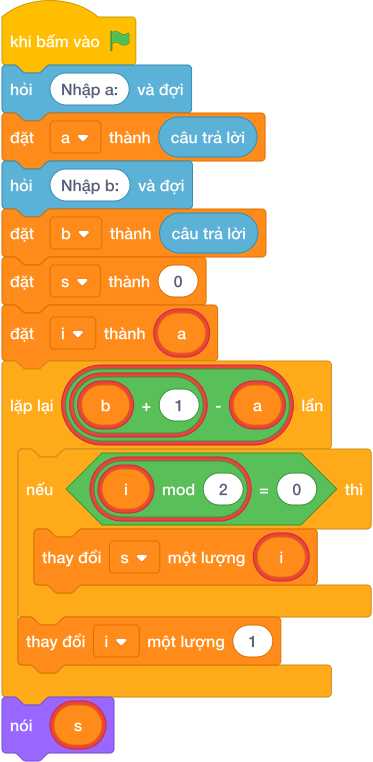

# Hướng Dẫn Giảng Dạy

## 1. Ý tưởng & Phân tích thuật toán
- Bản chất: trong đoạn từ A tới B chỉ cộng những số chia hết cho 2 (`(i mod 2) == 0`). Các số lẻ bị bỏ qua.
- Quy trình trong lời giải: đọc `a` rồi đọc `b`, đặt `s = 0`, vòng lặp cho `i` chạy từ `a` tới `b` (kể cả `b` nhờ `range(a, b + 1)`), nếu `(i mod 2) == 0` thì `s += i`, cuối cùng in `s`.
- Xử lý biên: đoạn nhỏ nhất A = B = 1 thì không có số chẵn nào nên tổng là 0; đoạn tới 10 000 thì vòng lặp duyệt tối đa 10 000 số.

---

## 2. Bảng chạy tay trên số liệu mẫu (Dry Run Table - Sample 1: 3 / 8)
| Lượt lặp | Giá trị của `i` | `(i mod 2) == 0`? | Giá trị mới của `s` |
|---|---|---|---|
| đầu | — | — | 0 |
| 1 | 3 | không | 0 |
| 2 | 4 | có, cộng 4 | 4 |
| 3 | 5 | không | 4 |
| 4 | 6 | có, cộng 6 | 10 |
| 5 | 7 | không | 10 |
| 6 | 8 | có, cộng 8 | 18 |

In ra `18` (vì `4 + 6 + 8 = 18`), khớp với kết quả mẫu.

---

## 3. Lưu ý & Bẫy lỗi thường gặp
- Bẫy 1 — quên cộng 1 ở điểm dừng:
```text
a = câu trả lời
b = câu trả lời
s = 0
for i in range(a, b):
    if (i mod 2) == 0:
        s += i
nói (s)

```
Với mẫu `3 / 8` chỉ xét tới 7 nên in ra `10` thay vì `18`. Cách sửa: dùng `range(a, b + 1)`.
- Bẫy 2 — kiểm tra số lẻ thay vì số chẵn:
```text
a = câu trả lời
b = câu trả lời
s = 0
for i in range(a, b + 1):
    if (i mod 2) == 1:
        s += i
nói (s)

```
Với mẫu `3 / 8` sẽ cộng 3 + 5 + 7 = `15` thay vì `18`. Cách sửa: điều kiện đúng là `(i mod 2) == 0`.

---

## 4. Lời giải tham khảo & Kịch bản Khối lệnh Scratch 3.0

### 4.1. Khối lệnh đồ họa trực quan (Visual Scratch Blocks)



> 💡 **Kịch bản thực hiện từng bước:**
> - khi bấm vào cờ xanh
> - hỏi [Nhập a:] và đợi
> - đặt [a] thành (câu trả lời)
> - hỏi [Nhập b:] và đợi
> - đặt [b] thành (câu trả lời)
> - đặt [s] thành (0)
> - đặt [i] thành (a)
> - lặp lại (b + 1 - a) lần:
> -   nếu <i mod 2 = 0> thì:
> -     thay đổi [s] một lượng (i)
> -   thay đổi [i] một lượng 1
> - nói (s)
