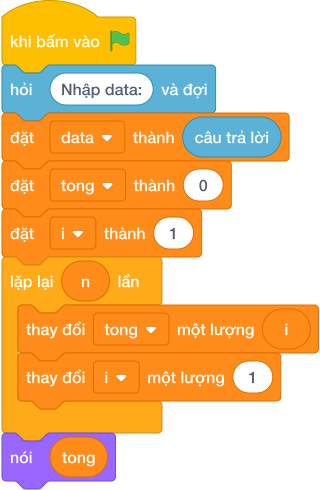

# Hướng Dẫn Giảng Dạy: Đếm bội số của K
Chuyên đề: **Lập Trình Thuật Toán & Khối Lệnh Scratch 3.0**

---

## 1. Ý tưởng & Phân tích thuật toán
- Bản chất: đếm các số trong đoạn [A, B] chia hết cho K, tức `i % k == 0`. Khác bài tính tổng, ở đây biến `count` tăng 1 mỗi khi gặp bội số.
- Quy trình trong lời giải: đọc 3 số vào danh sách `data` rồi tách `a, b, k`; đặt `count = 0`; vòng lặp cho `i` chạy từ `a` tới `b` (kể cả `b`), gặp bội của `k` thì `count = count + 1`; cuối cùng in `count`.
- Xử lý biên: nếu K lớn hơn cả đoạn (ví dụ A = 1, B = 10, K = 100) thì kết quả là 0; B tới 100 000 nên vòng lặp duyệt trực tiếp vẫn kịp.

---

## 2. Bảng chạy tay trên số liệu mẫu (Dry Run Table - Sample 1: 1 / 10 / 3)
| Lượt lặp | Giá trị của `i` | `i % 3 == 0`? | Giá trị mới của `count` |
|---|---|---|---|
| đầu | — | — | 0 |
| 1 | 1 | không | 0 |
| 2 | 2 | không | 0 |
| 3 | 3 | có | 1 |
| 4 | 4 | không | 1 |
| 5 | 5 | không | 1 |
| 6 | 6 | có | 2 |
| 7 | 7 | không | 2 |
| 8 | 8 | không | 2 |
| 9 | 9 | có | 3 |
| 10 | 10 | không | 3 |

In ra `3` (các số 3, 6, 9), khớp với kết quả mẫu.

---

## 3. Lưu ý & Bẫy lỗi thường gặp
- Bẫy 1 — đọc sai thứ tự:
```text
a = int(câu trả lời)
k = int(câu trả lời)
b = int(câu trả lời)
```
Với mẫu `1 / 10 / 3` sẽ hiểu K = 10, B = 3 nên đoạn rỗng và in ra `0`. Cách sửa: giữ đúng thứ tự `a, b, k` như lời giải.
- Bẫy 2 — cộng `i` thay vì tăng `count`:
```text
count = 0
for i in range(a, b + 1):
    if i % k == 0:
        count = count + i
print(count)
```
Với mẫu `1 / 10 / 3` sẽ in ra `18` (tổng) thay vì `3` (số lượng). Cách sửa: tăng `count = count + 1`.

---

## 4. Lời giải tham khảo & Kịch bản Khối lệnh Scratch 3.0

### 4.1. Khối lệnh đồ họa trực quan (Visual Scratch Blocks)



> 💡 **Kịch bản thực hiện từng bước:**
> - khi bấm vào cờ xanh
> - hỏi [Nhập data:] và đợi
> - đặt [data] thành (câu trả lời)
> - đặt [tong] thành (0)
> - đặt [i] thành (1)
> - lặp lại (n) lần:
> -   thay đổi [tong] một lượng (i)
> -   thay đổi [i] một lượng (1)
> - nói (tong)
