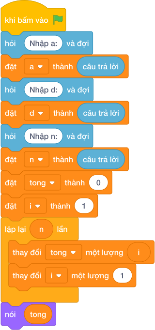

# Hướng Dẫn Giảng Dạy: Dãy số cách đều
Chuyên đề: **Lập Trình Thuật Toán & Khối Lệnh Scratch 3.0**

---

## 1. Ý tưởng & Phân tích thuật toán
- Bản chất: dãy cộng với số hạng đầu `a`, công sai `d`. Số hạng thứ `i` (đếm từ 0) là `a + i * d`.
- Quy trình trong lời giải: đọc `a`, `d`, `n`; vòng lặp cho `i` chạy `range(n)`, mỗi lượt in `a + i * d`; nếu chưa phải số cuối (`i < n - 1`) thì in thêm một dấu cách, cuối cùng xuống dòng.
- Xử lý biên: với n nhỏ nhất là 1 thì chỉ in mỗi `a`; mỗi giá trị a, d, n đều không vượt quá 100.

---

## 2. Bảng chạy tay trên số liệu mẫu (Dry Run Table - Sample 1: 2 / 3 / 5)
| Lượt lặp | Giá trị của `i` | Tính `2 + i * 3` | Phần in ra |
|---|---|---|---|
| 1 | 0 | 2 | `2 ` |
| 2 | 1 | 5 | `5 ` |
| 3 | 2 | 8 | `8 ` |
| 4 | 3 | 11 | `11 ` |
| 5 | 4 | 14 | `14` + xuống dòng |

Một dòng duy nhất `2 5 8 11 14`, khớp với kết quả mẫu.

---

## 3. Lưu ý & Bẫy lỗi thường gặp
- Bẫy 1 — công thức thiếu `a`:
```text
a = int(câu trả lời)
d = int(câu trả lời)
n = int(câu trả lời)
for i in range(n):
    print(a + d, end='')
```
Với mẫu `2 / 3 / 5` sẽ in toàn số `5` lặp lại. Cách sửa: công thức đúng là `a + i * d`.
- Bẫy 2 — mỗi số một dòng:
```text
a = int(câu trả lời)
d = int(câu trả lời)
n = int(câu trả lời)
for i in range(n):
    print(a + i * d)
```
Với mẫu `2 / 3 / 5` sẽ in 5 dòng thay vì một dòng `2 5 8 11 14`. Cách sửa: in với `end=''` và chèn dấu cách giữa các số như lời giải.

---

## 4. Lời giải tham khảo & Kịch bản Khối lệnh Scratch 3.0

### 4.1. Khối lệnh đồ họa trực quan (Visual Scratch Blocks)



> 💡 **Kịch bản thực hiện từng bước:**
> - khi bấm vào cờ xanh
> - hỏi [Nhập a:] và đợi
> - đặt [a] thành (câu trả lời)
> - hỏi [Nhập d:] và đợi
> - đặt [d] thành (câu trả lời)
> - hỏi [Nhập n:] và đợi
> - đặt [n] thành (câu trả lời)
> - đặt [tong] thành (0)
> - đặt [i] thành (1)
> - lặp lại (n) lần:
> -   thay đổi [tong] một lượng (i)
> -   thay đổi [i] một lượng (1)
> - nói (tong)
