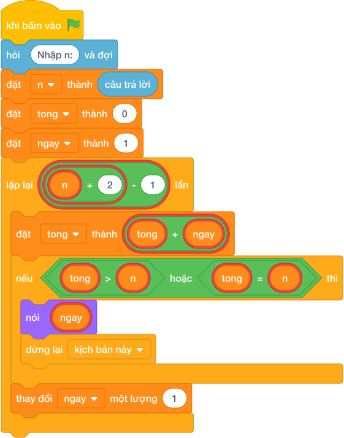

# Hướng Dẫn Giảng Dạy

## 1. Ý tưởng & Phân tích thuật toán
- Bản chất: ngày thứ `ngay` đọc được đúng `ngay` trang, tổng sau k ngày là `1 + 2 + ... + k`. Tìm k nhỏ nhất sao cho tổng đạt hoặc vượt N.
- Quy trình trong lời giải: đọc `n`, biến `tong` cộng dồn từng `ngay` trong `range(1, n + 2)`; ngay khi `tong >= n` thì in `ngay` và `break` dừng lại.
- Xử lý biên: với N nhỏ nhất là 1 thì ngày 1 đã đủ (tổng 1) nên in `1`; với N lớn nhất là 10 000 thì vòng lặp `range(1, n + 2)` luôn đủ dài để tìm ra đáp án.

---

## 2. Bảng chạy tay trên số liệu mẫu (Dry Run Table - Sample 1: 10)
| Ngày (`ngay`) | Số trang ngày đó | Tổng `tong` | `tong >= 10`? |
|---|---|---|---|
| đầu | — | 0 | — |
| 1 | 1 | 1 | chưa |
| 2 | 2 | 3 | chưa |
| 3 | 3 | 6 | chưa |
| 4 | 4 | 10 | đủ, in 4 và dừng |

In ra `4`, khớp với kết quả mẫu.

---

## 3. Lưu ý & Bẫy lỗi thường gặp
- Bẫy 1 — quên `break` sau khi in:
```text
n = câu trả lời
tong = 0
for ngay in range(1, n + 2):
    tong = tong + ngay
    if tong >= n:
        nói (ngay)

```
Với mẫu `10` sẽ in thêm các ngày 5, 6, ... vì vòng lặp không dừng. Cách sửa: thêm `break` ngay sau `nói (ngay)`.
- Bẫy 2 — so sánh bằng thay vì lớn hơn hoặc bằng:
```text
n = câu trả lời
tong = 0
for ngay in range(1, n + 2):
    tong = tong + ngay
    if tong == n:
        nói (ngay)
        break

```
Với những N không phải tổng của dãy liên tiếp (ví dụ N = 11: tổng nhảy từ 10 lên 15) thì không bao giờ bằng nên chẳng in gì. Cách sửa: điều kiện đúng là `tong >= n`.

---

## 4. Lời giải tham khảo & Kịch bản Khối lệnh Scratch 3.0

### 4.1. Khối lệnh đồ họa trực quan (Visual Scratch Blocks)



> 💡 **Kịch bản thực hiện từng bước:**
> - khi bấm vào cờ xanh
> - hỏi [Nhập n:] và đợi
> - đặt [n] thành (câu trả lời)
> - đặt [tong] thành (0)
> - đặt [ngay] thành (1)
> - lặp lại (n + 2 - 1) lần:
> -   đặt [tong] thành (tong + ngay)
> -   nếu <tong >= n> thì:
> -     nói (ngay)
> -     dừng kịch bản này
> -   thay đổi [ngay] một lượng 1
