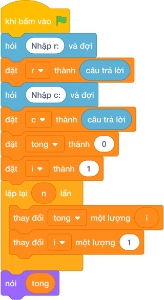

# Hướng Dẫn Giảng Dạy: Hàng cột dấu sao
Chuyên đề: **Lập Trình Thuật Toán & Khối Lệnh Scratch 3.0**

---

## 1. Ý tưởng & Phân tích thuật toán
- Bản chất: hình chữ nhật đặc kích thước R hàng, C cột. Mỗi hàng là chuỗi `'*' * c` dài đúng C ký tự, lặp lại R lần.
- Quy trình trong lời giải: đọc `r` rồi đọc `c`, vòng lặp `for i in range(r)` in `nói ('*' * c)` mỗi lượt một hàng.
- Xử lý biên: với R = 1, C = 1 thì chỉ in một dấu `*`; với R = 50, C = 50 thì in 50 hàng, mỗi hàng 50 dấu sao.

---

## 2. Bảng chạy tay trên số liệu mẫu (Dry Run Table - Sample 1: 3 / 5)
| Lượt lặp | `i` trong `range(3)` | `'*' * 5` | Dòng in ra |
|---|---|---|---|
| 1 | 0 | `*****` | ***** |
| 2 | 1 | `*****` | ***** |
| 3 | 2 | `*****` | ***** |

Ba hàng giống nhau ghép thành hình chữ nhật 3x5, khớp với kết quả mẫu.

---

## 3. Lưu ý & Bẫy lỗi thường gặp
- Bẫy 1 — đọc cả hai số trên một dòng:
```text
r, c = map(int, câu trả lời.split())
for i in range(r):
    print('*' * c)
```
Với mẫu nhập `3` rồi xuống dòng `5`, lệnh tách một dòng sẽ thiếu số và lỗi. Cách sửa: đọc riêng `r = int(câu trả lời)` rồi `c = int(câu trả lời)` như lời giải.
- Bẫy 2 — nhầm số hàng với số cột:
```text
r = int(câu trả lời)
c = int(câu trả lời)
for i in range(c):
    print('*' * r)
```
Với mẫu `3 / 5` sẽ in 5 hàng mỗi hàng 3 sao, cho kết quả sai kích thước. Cách sửa: lặp `range(r)` và nhân `'*' * c`.

---

## 4. Lời giải tham khảo & Kịch bản Khối lệnh Scratch 3.0

### 4.1. Khối lệnh đồ họa trực quan (Visual Scratch Blocks)



> 💡 **Kịch bản thực hiện từng bước:**
> - khi bấm vào cờ xanh
> - hỏi [Nhập r:] và đợi
> - đặt [r] thành (câu trả lời)
> - hỏi [Nhập c:] và đợi
> - đặt [c] thành (câu trả lời)
> - đặt [tong] thành (0)
> - đặt [i] thành (1)
> - lặp lại (n) lần:
> -   thay đổi [tong] một lượng (i)
> -   thay đổi [i] một lượng (1)
> - nói (tong)
