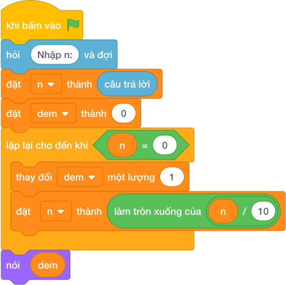

# Hướng Dẫn Giảng Dạy: Đếm xuôi bằng while
Chuyên đề: **Lập Trình Thuật Toán & Khối Lệnh Scratch 3.0**

---

## 1. Ý tưởng & Phân tích thuật toán
- Bản chất: giống bài đếm sao nhưng bắt buộc dùng vòng lặp `while` với lính canh `i <= n`. Biến `i` bắt đầu từ 1 và tự tăng 1 sau mỗi lượt.
- Quy trình trong lời giải: đọc `n`, đặt `i = 1` và danh sách rỗng `res`; chừng nào `i <= n` thì thêm `str(i)` vào `res` rồi `i += 1`; cuối cùng nối `res` bằng dấu cách và in ra.
- Xử lý biên: với N nhỏ nhất là 1 thì chỉ in `1`; với N lớn nhất là 100 thì in đủ 100 số.

---

## 2. Bảng chạy tay trên số liệu mẫu (Dry Run Table - Sample 1: 5)
| Lần kiểm tra | Giá trị của `i` | `i <= 5`? | `res` sau bước |
|---|---|---|---|
| đầu | 1 | đúng | [1] |
| 2 | 2 | đúng | [1, 2] |
| 3 | 3 | đúng | [1, 2, 3] |
| 4 | 4 | đúng | [1, 2, 3, 4] |
| 5 | 5 | đúng | [1, 2, 3, 4, 5] |
| 6 | 6 | sai, dừng | — |

In ra một dòng `1 2 3 4 5`, khớp với kết quả mẫu.

---

## 3. Lưu ý & Bẫy lỗi thường gặp
- Bẫy 1 — quên tăng `i`:
```text
n = int(câu trả lời.strip())
i = 1
res = []
while i <= n:
    res.append(str(i))
print(" ".join(res))
```
Với mẫu `5` vòng lặp chạy mãi không dừng vì `i` luôn bằng 1. Cách sửa: thêm `i += 1` trong vòng lặp.
- Bẫy 2 — khởi đầu `i = 0`:
```text
n = int(câu trả lời.strip())
i = 0
res = []
while i <= n:
    res.append(str(i))
    i += 1
print(" ".join(res))
```
Với mẫu `5` sẽ in ra `0 1 2 3 4 5` thừa số 0. Cách sửa: khởi đầu `i = 1`.

---

## 4. Lời giải tham khảo & Kịch bản Khối lệnh Scratch 3.0

### 4.1. Khối lệnh đồ họa trực quan (Visual Scratch Blocks)



> 💡 **Kịch bản thực hiện từng bước:**
> - khi bấm vào cờ xanh
> - hỏi [Nhập n:] và đợi
> - đặt [n] thành (câu trả lời)
> - đặt [dem] thành (0)
> - lặp lại cho đến khi <n = 0>:
> -   thay đổi [dem] một lượng (1)
> -   đặt [n] thành (làm tròn xuống của n / 10)
> - nói (dem)
