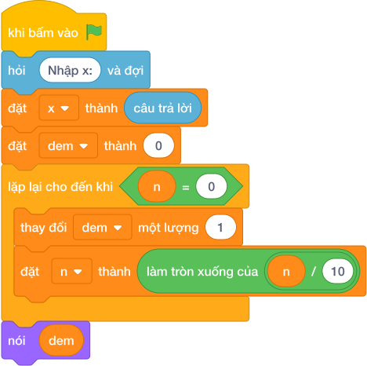

# Hướng Dẫn Giảng Dạy: Tổng dãy số kết thúc bằng 0
Chuyên đề: **Lập Trình Thuật Toán & Khối Lệnh Scratch 3.0**

---

## 1. Ý tưởng & Phân tích thuật toán
- Bản chất: giống bài đếm tới số 0 nhưng thay vì đếm số lượng, ở đây cộng dồn giá trị vào biến `tong`. Số 0 cũng không được cộng.
- Quy trình trong lời giải: đặt `tong = 0`; `while True` đọc từng `x`; nếu `x == 0` thì `break`; ngược lại `tong = tong + x`; cuối cùng in `tong`.
- Xử lý biên: nếu nhập ngay số 0 thì tổng là 0; dãy mẫu 10, 20, 5 cho tổng 35.

---

## 2. Bảng chạy tay trên số liệu mẫu (Dry Run Table - Sample 1: 10 / 20 / 5 / 0)
| Lần đọc | Giá trị của `x` | `x == 0`? | `tong` sau bước |
|---|---|---|---|
| đầu | — | — | 0 |
| 1 | 10 | không | 10 |
| 2 | 20 | không | 30 |
| 3 | 5 | không | 35 |
| 4 | 0 | có, dừng | 35 |

In ra `35` (vì `10 + 20 + 5 = 35`), khớp với kết quả mẫu.

---

## 3. Lưu ý & Bẫy lỗi thường gặp
- Bẫy 1 — cộng luôn số 0 rồi mới kiểm tra (vẫn đúng trị nhưng lỗi tư duy), bẫy thật là tăng nhầm biến:
```text
tong = 0
while True:
    x = int(câu trả lời)
    if x == 0:
        break
    tong = tong + 1
print(tong)
```
Với mẫu `10 / 20 / 5 / 0` sẽ in ra `3` (đếm số lượng) thay vì `35` (tổng). Cách sửa: cộng đúng `tong = tong + x`.
- Bẫy 2 — in tổng trong vòng lặp:
```text
tong = 0
while True:
    x = int(câu trả lời)
    if x == 0:
        break
    tong = tong + x
    print(tong)
```
Với mẫu sẽ in 3 dòng `10 / 30 / 35` thay vì một dòng `35`. Cách sửa: để `nói (tong)` ngoài vòng lặp.

---

## 4. Lời giải tham khảo & Kịch bản Khối lệnh Scratch 3.0

### 4.1. Khối lệnh đồ họa trực quan (Visual Scratch Blocks)



> 💡 **Kịch bản thực hiện từng bước:**
> - khi bấm vào cờ xanh
> - hỏi [Nhập x:] và đợi
> - đặt [x] thành (câu trả lời)
> - đặt [dem] thành (0)
> - lặp lại cho đến khi <n = 0>:
> -   thay đổi [dem] một lượng (1)
> -   đặt [n] thành (làm tròn xuống của n / 10)
> - nói (dem)
