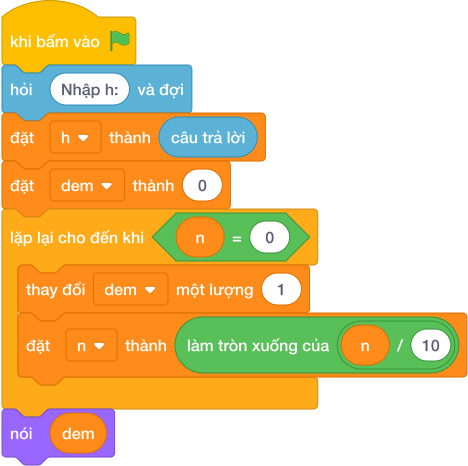

# Hướng Dẫn Giảng Dạy: Gấp đôi tờ giấy lên mặt trăng
Chuyên đề: **Lập Trình Thuật Toán & Khối Lệnh Scratch 3.0**

---

## 1. Ý tưởng & Phân tích thuật toán
- Bản chất: độ dày tờ giấy nhân đôi sau mỗi lần gấp: 1, 2, 4, 8, 16, ... Đếm xem gấp mấy lần thì đạt hoặc vượt chiều cao H.
- Quy trình trong lời giải: đọc `h`, đặt `day = 1` và `count = 0`; chừng nào `day < h` thì `day = day * 2` và `count = count + 1`; cuối cùng in `count`.
- Xử lý biên: với H nhỏ nhất là 1 thì không cần gấp lần nào nên in `0`; với H tới 1 000 000 000 thì gấp khoảng 30 lần là đủ.

---

## 2. Bảng chạy tay trên số liệu mẫu (Dry Run Table - Sample 1: 10)
| Lần kiểm tra | `day` | `day < 10`? | `count` sau bước |
|---|---|---|---|
| đầu | 1 | đúng | 0 |
| 1 | 2 | đúng | 1 |
| 2 | 4 | đúng | 2 |
| 3 | 8 | đúng | 3 |
| 4 | 16 | sai (16 >= 10) | 4, dừng |

In ra `4` (2mm, 4mm, 8mm, 16mm), khớp với kết quả mẫu.

---

## 3. Lưu ý & Bẫy lỗi thường gặp
- Bẫy 1 — tăng `count` trước khi gấp:
```text
h = int(câu trả lời)
day = 1
count = 0
while day < h:
    count = count + 1
    day = day * 2
print(count)
```
Trông giống nhau nhưng với cách này thứ tự vẫn đúng; bẫy thật sự là khởi đầu `day = 0`:
```text
h = int(câu trả lời)
day = 0
count = 0
while day < h:
    day = day * 2
    count = count + 1
print(count)
```
Với mẫu `10` thì `0 * 2` mãi bằng 0 nên vòng lặp không bao giờ dừng. Cách sửa: khởi đầu `day = 1`.
- Bẫy 2 — điều kiện `day <= h`:
```text
h = int(câu trả lời)
day = 1
count = 0
while day <= h:
    day = day * 2
    count = count + 1
print(count)
```
Khi H đúng bằng lũy thừa của 2 (ví dụ H = 8) sẽ đếm thừa một lần. Cách sửa: điều kiện đúng là `while day < h`.

---

## 4. Lời giải tham khảo & Kịch bản Khối lệnh Scratch 3.0

### 4.1. Khối lệnh đồ họa trực quan (Visual Scratch Blocks)



> 💡 **Kịch bản thực hiện từng bước:**
> - khi bấm vào cờ xanh
> - hỏi [Nhập h:] và đợi
> - đặt [h] thành (câu trả lời)
> - đặt [dem] thành (0)
> - lặp lại cho đến khi <n = 0>:
> -   thay đổi [dem] một lượng (1)
> -   đặt [n] thành (làm tròn xuống của n / 10)
> - nói (dem)
