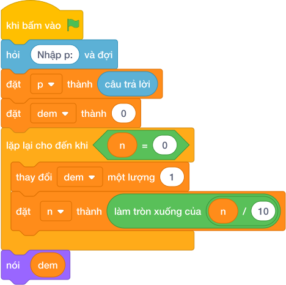

# Hướng Dẫn Giảng Dạy: Ống heo mua xe máy
Chuyên đề: **Lập Trình Thuật Toán & Khối Lệnh Scratch 3.0**

---

## 1. Ý tưởng & Phân tích thuật toán
- Bản chất: ngày thứ `ngay` bỏ vào đúng `ngay` nghìn đồng, tổng sau k ngày là `1 + 2 + ... + k`. Tìm k nhỏ nhất để tổng đạt hoặc vượt P.
- Quy trình trong lời giải: đọc `p`, đặt `tong = 0` và `ngay = 0`; chừng nào `tong < p` thì tăng `ngay` thêm 1 rồi cộng `tong = tong + ngay`; cuối cùng in `ngay`.
- Xử lý biên: với P nhỏ nhất là 1 thì ngày 1 đã đủ nên in `1`; với P tới 10 000 000 thì số ngày khoảng 4472 ngày.

---

## 2. Bảng chạy tay trên số liệu mẫu (Dry Run Table - Sample 1: 15)
| Ngày (`ngay`) | Bỏ vào ngày đó | Tổng `tong` | `tong < 15`? |
|---|---|---|---|
| đầu | — | 0 | đúng |
| 1 | 1 | 1 | đúng |
| 2 | 2 | 3 | đúng |
| 3 | 3 | 6 | đúng |
| 4 | 4 | 10 | đúng |
| 5 | 5 | 15 | sai, dừng |

In ra `5`, khớp với kết quả mẫu.

---

## 3. Lưu ý & Bẫy lỗi thường gặp
- Bẫy 1 — cộng trước khi tăng ngày:
```text
p = int(câu trả lời)
tong = 0
ngay = 0
while tong < p:
    tong = tong + ngay
    ngay = ngay + 1
print(ngay)
```
Với mẫu `15` thì ngày đầu cộng 0 nên kết quả lệch thành `6`. Cách sửa: tăng `ngay` trước rồi mới cộng `tong = tong + ngay`.
- Bẫy 2 — mỗi ngày bỏ cố định 1 nghìn:
```text
p = int(câu trả lời)
tong = 0
ngay = 0
while tong < p:
    ngay = ngay + 1
    tong = tong + 1
print(ngay)
```
Với mẫu `15` sẽ in ra `15` thay vì `5`. Cách sửa: ngày thứ `ngay` phải cộng đúng `ngay` nghìn.

---

## 4. Lời giải tham khảo & Kịch bản Khối lệnh Scratch 3.0

### 4.1. Khối lệnh đồ họa trực quan (Visual Scratch Blocks)



> 💡 **Kịch bản thực hiện từng bước:**
> - khi bấm vào cờ xanh
> - hỏi [Nhập p:] và đợi
> - đặt [p] thành (câu trả lời)
> - đặt [dem] thành (0)
> - lặp lại cho đến khi <n = 0>:
> -   thay đổi [dem] một lượng (1)
> -   đặt [n] thành (làm tròn xuống của n / 10)
> - nói (dem)
