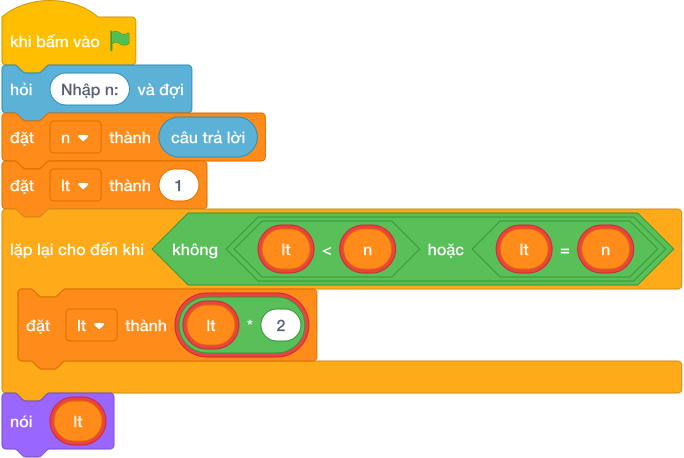

# Hướng Dẫn Giảng Dạy

## 1. Ý tưởng & Phân tích thuật toán
- Bản chất: dãy lũy thừa của 2 là 1, 2, 4, 8, 16, ... Mỗi bước nhân đôi `lt = lt * 2` cho tới khi vượt qua N.
- Quy trình trong lời giải: đọc `n`, đặt `lt = 1`; chừng nào `lt <= n` thì nhân đôi `lt`; khi thoát vòng lặp thì `lt` là số cần tìm, đem in ra.
- Xử lý biên: với N nhỏ nhất là 1 thì `lt` đi 1 thành 2 nên in `2`; với N tới 1 000 000 000 thì nhân đôi khoảng 30 lần là xong.

---

## 2. Bảng chạy tay trên số liệu mẫu (Dry Run Table - Sample 1: 10)
| Lần kiểm tra | Giá trị của `lt` | `lt <= 10`? | Hành động |
|---|---|---|---|
| đầu | 1 | đúng | lt thành 2 |
| 2 | 2 | đúng | lt thành 4 |
| 3 | 4 | đúng | lt thành 8 |
| 4 | 8 | đúng | lt thành 16 |
| 5 | 16 | sai | dừng, in 16 |

In ra `16` là lũy thừa của 2 nhỏ nhất mà lớn hơn 10, khớp với kết quả mẫu.

---

## 3. Lưu ý & Bẫy lỗi thường gặp
- Bẫy 1 — điều kiện dừng sai thành `lt < n`:
```text
n = câu trả lời
lt = 1
while lt < n:
    lt = lt * 2
nói (lt)

```
Nếu N bản thân là lũy thừa của 2 (ví dụ N = 8) sẽ in ra `8` thay vì `16`. Cách sửa: điều kiện đúng là `while lt <= n`.
- Bẫy 2 — quên nhân đôi bên trong vòng lặp:
```text
n = câu trả lời
lt = 1
while lt <= n:
    lt = lt + 1
nói (lt)

```
Với mẫu `10` sẽ in ra `11` thay vì `16`. Cách sửa: mỗi bước phải nhân đôi `lt = lt * 2`.

---

## 4. Lời giải tham khảo & Kịch bản Khối lệnh Scratch 3.0

### 4.1. Khối lệnh đồ họa trực quan (Visual Scratch Blocks)



> 💡 **Kịch bản thực hiện từng bước:**
> - khi bấm vào cờ xanh
> - hỏi [Nhập n:] và đợi
> - đặt [n] thành (câu trả lời)
> - đặt [lt] thành (1)
> - lặp lại cho đến khi không còn <lt <= n>:
> -   đặt [lt] thành (lt * 2)
> - nói (lt)
