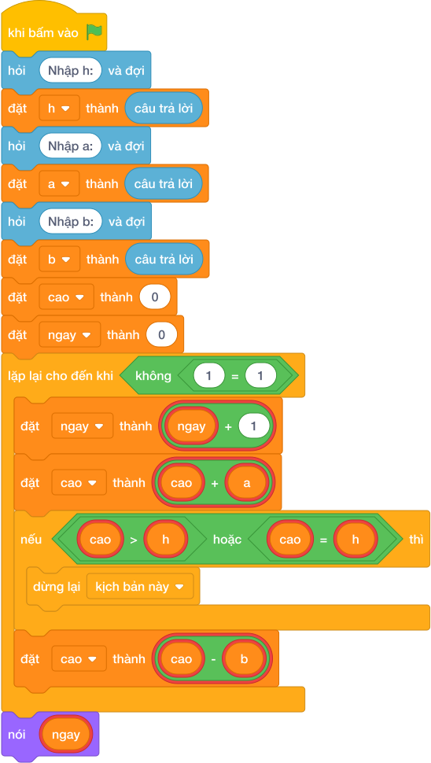

# Hướng Dẫn Giảng Dạy

## 1. Ý tưởng & Phân tích thuật toán
- Bản chất: mỗi ngày leo lên A mét, nếu chưa chạm đỉnh thì đêm tụt B mét. Ngày chạm hoặc vượt đỉnh thì dừng ngay, không tụt nữa.
- Quy trình trong lời giải: đọc `h`, `a`, `b`; đặt `cao = 0` và `ngay = 0`; mỗi vòng tăng `ngay`, cộng `cao = cao + a`, kiểm tra `cao >= h` thì dừng, chưa đủ thì trừ `cao = cao - b`.
- Xử lý biên: nếu A đã lớn hơn hoặc bằng H (ví dụ H = 5, A = 5) thì ngày 1 đã xong; đề đảm bảo B < A nên mỗi ngày tiến thêm `A - B` mét, vòng lặp chắc chắn dừng.

---

## 2. Bảng chạy tay trên số liệu mẫu (Dry Run Table - Sample 1: 5 / 3 / 1)
| Ngày (`ngay`) | `cao` sau khi leo (+3) | Chạm đỉnh (`>= 5`)? | `cao` sau đêm (-1) |
|---|---|---|---|
| đầu | 0 | — | — |
| 1 | 3 | chưa | 2 |
| 2 | 5 | đủ, dừng | — |

In ra `2`, khớp với kết quả mẫu (ngày 1 còn 2m, ngày 2 chạm 5m).

---

## 3. Lưu ý & Bẫy lỗi thường gặp
- Bẫy 1 — trừ B trước khi kiểm tra đỉnh:
```text
h = câu trả lời
a = câu trả lời
b = câu trả lời
cao = 0
ngay = 0
while True:
    ngay = ngay + 1
    cao = cao + a - b
    if cao >= h:
        break
nói (ngay)

```
Với mẫu `5 / 3 / 1` thì ngày 2 tính thành 4 nên phải sang ngày 3, in ra `3` thay vì `2`. Cách sửa: cộng A rồi kiểm tra đỉnh trước, chỉ trừ B khi chưa chạm đỉnh.
- Bẫy 2 — công thức một dòng bỏ qua đêm cuối:
```text
h = câu trả lời
a = câu trả lời
b = câu trả lời
nói ((h + (a - b) - 1) // (a - b))

```
Với mẫu `5 / 3 / 1` cho `(5 + 1) // 2 = 3` thay vì `2` vì đêm cuối không bị tụt. Cách sửa: mô phỏng từng ngày bằng vòng lặp như lời giải.

---

## 4. Lời giải tham khảo & Kịch bản Khối lệnh Scratch 3.0

### 4.1. Khối lệnh đồ họa trực quan (Visual Scratch Blocks)



> 💡 **Kịch bản thực hiện từng bước:**
> - khi bấm vào cờ xanh
> - hỏi [Nhập h:] và đợi
> - đặt [h] thành (câu trả lời)
> - hỏi [Nhập a:] và đợi
> - đặt [a] thành (câu trả lời)
> - hỏi [Nhập b:] và đợi
> - đặt [b] thành (câu trả lời)
> - đặt [cao] thành (0)
> - đặt [ngay] thành (0)
> - lặp lại cho đến khi không còn <điều kiện>:
> -   đặt [ngay] thành (ngay + 1)
> -   đặt [cao] thành (cao + a)
> -   nếu <cao >= h> thì:
> -     dừng kịch bản này
> -   đặt [cao] thành (cao - b)
> - nói (ngay)
