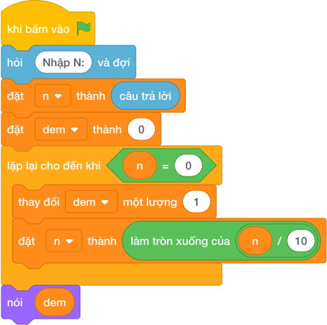

# Hướng Dẫn Giảng Dạy: Đếm số lượng chữ số của N
Chuyên đề: **Lập Trình Thuật Toán & Khối Lệnh Scratch 3.0**

---

## 1. Ý tưởng & Phân tích thuật toán
- Bản chất: mỗi lần chia nguyên cho 10 (`N // 10`) là rụng đi một chữ số cuối. Đếm xem rụng mấy lần thì N còn 0.
- Quy trình trong lời giải: đọc `N`, đặt `dem = 0`; chừng nào `N > 0` thì `N = N // 10` và `dem = dem + 1`; cuối cùng in `dem`.
- Xử lý biên: với N nhỏ nhất là 1 thì chia một lần là hết nên in `1`; với N tới 10^18 (tối đa 19 chữ số nếu tính cả giới hạn) thì vòng lặp chạy đúng bằng số chữ số.

---

## 2. Bảng chạy tay trên số liệu mẫu (Dry Run Table - Sample 1: 2026)
| Lần kiểm tra | Giá trị của `N` | `N > 0`? | `dem` sau bước |
|---|---|---|---|
| đầu | 2026 | đúng | 0 |
| 1 | 202 | đúng | 1 |
| 2 | 20 | đúng | 2 |
| 3 | 2 | đúng | 3 |
| 4 | 0 | sai, dừng | 4 |

In ra `4` vì 2026 có 4 chữ số, khớp với kết quả mẫu.

---

## 3. Lưu ý & Bẫy lỗi thường gặp
- Bẫy 1 — dùng chia `/` thay vì `//`:
```text
N = int(câu trả lời)
dem = 0
while N > 0:
      N = N / 10
      dem = dem + 1
print(dem)
```
Với mẫu `2026` thì N thành số thực 202.6, 20.26, ... không bao giờ bằng 0 đúng cách và có thể lặp rất lâu. Cách sửa: dùng `N = N // 10`.
- Bẫy 2 — điều kiện `N >= 0`:
```text
N = int(câu trả lời)
dem = 0
while N >= 0:
      N = N // 10
      dem = dem + 1
print(dem)
```
Với mẫu `2026` thì khi N đã về 0 vòng lặp vẫn chạy tiếp (0 // 10 vẫn là 0) nên không bao giờ dừng. Cách sửa: điều kiện đúng là `while N > 0`.

---

## 4. Lời giải tham khảo & Kịch bản Khối lệnh Scratch 3.0

### 4.1. Khối lệnh đồ họa trực quan (Visual Scratch Blocks)



> 💡 **Kịch bản thực hiện từng bước:**
> - khi bấm vào cờ xanh
> - hỏi [Nhập N:] và đợi
> - đặt [n] thành (câu trả lời)
> - đặt [dem] thành (0)
> - lặp lại cho đến khi <n = 0>:
> -   thay đổi [dem] một lượng (1)
> -   đặt [n] thành (làm tròn xuống của n / 10)
> - nói (dem)
