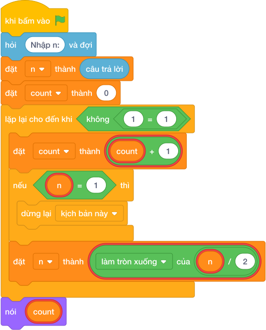

# Hướng Dẫn Giảng Dạy

## 1. Ý tưởng & Phân tích thuật toán
- Bản chất: mỗi lượt đoán thì khoảng tìm kiếm còn một nửa (`n = làm tròn xuống của (n / 2)`). Đếm xem chặt đôi mấy lần thì khoảng còn đúng 1 số.
- Quy trình trong lời giải: đọc `n`, đặt `count = 0`; `while True` thì tăng `count` thêm 1, nếu `n == 1` thì dừng, ngược lại chặt đôi `n = làm tròn xuống của (n / 2)`; cuối cùng in `count`.
- Xử lý biên: với N nhỏ nhất là 1 thì chỉ cần 1 lượt nên in `1`; với N tới 1 000 000 000 thì chặt đôi khoảng 30 lần.

---

## 2. Bảng chạy tay trên số liệu mẫu (Dry Run Table - Sample 1: 8)
| Lượt lặp | `n` đầu lượt | `count` sau khi tăng | Hành động |
|---|---|---|---|
| 1 | 8 | 1 | chưa bằng 1, n thành 4 |
| 2 | 4 | 2 | chưa bằng 1, n thành 2 |
| 3 | 2 | 3 | chưa bằng 1, n thành 1 |
| 4 | 1 | 4 | bằng 1, dừng |

In ra `4` (đường đi `8 -> 4 -> 2 -> 1`), khớp với kết quả mẫu.

---

## 3. Lưu ý & Bẫy lỗi thường gặp
- Bẫy 1 — tăng `count` sau khi kiểm tra:
```text
n = câu trả lời
count = 0
while True:
    if n == 1:
        break
    n = làm tròn xuống của (n / 2)
    count = count + 1
nói (count)

```
Với mẫu `8` sẽ in ra `3` thay vì `4` vì lượt cuối không được đếm. Cách sửa: tăng `count` ngay đầu vòng lặp như lời giải.
- Bẫy 2 — dùng chia `/`:
```text
n = câu trả lời
count = 0
while True:
    count = count + 1
    if n == 1:
        break
    n = n / 2
nói (count)

```
Với mẫu `8` thì n thành 4.0, 2.0, 1.0 rồi so sánh vẫn đúng, nhưng với N lớn số thực mất chính xác. Cách sửa: dùng `n = làm tròn xuống của (n / 2)`.

---

## 4. Lời giải tham khảo & Kịch bản Khối lệnh Scratch 3.0

### 4.1. Khối lệnh đồ họa trực quan (Visual Scratch Blocks)



> 💡 **Kịch bản thực hiện từng bước:**
> - khi bấm vào cờ xanh
> - hỏi [Nhập n:] và đợi
> - đặt [n] thành (câu trả lời)
> - đặt [count] thành (0)
> - lặp lại cho đến khi không còn <điều kiện>:
> -   đặt [count] thành (count + 1)
> -   nếu <n = 1> thì:
> -     dừng kịch bản này
> -   đặt [n] thành (n chia nguyên 2)
> - nói (count)
