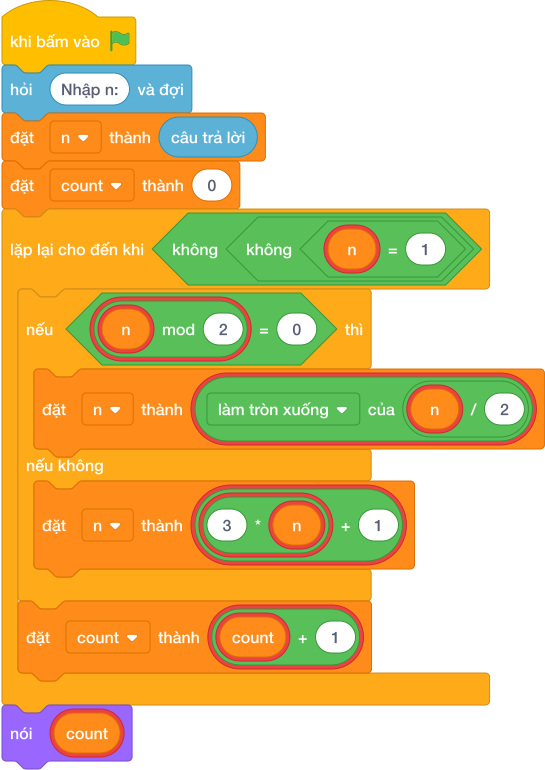

# Hướng Dẫn Giảng Dạy

## 1. Ý tưởng & Phân tích thuật toán
- Bản chất: luật biến hình Collatz: số chẵn thì chia đôi (`n = làm tròn xuống của (n / 2)`), số lẻ thì nhân ba cộng một (`n = 3 * n + 1`). Biến `count` đếm mỗi lần biến hình cho tới khi n thành 1.
- Quy trình trong lời giải: đọc `n`, đặt `count = 0`; chừng nào `n != 1` thì xét chẵn lẻ để biến đổi rồi tăng `count`; cuối cùng in `count`.
- Xử lý biên: với N nhỏ nhất là 1 thì không biến hình lần nào nên in `0`; với N tới 100 000 vòng lặp vẫn kết thúc và cho kết quả đúng.

---

## 2. Bảng chạy tay trên số liệu mẫu (Dry Run Table - Sample 1: 6)
| Bước | `n` đầu bước | Chẵn hay lẻ? | `n` sau bước | `count` |
|---|---|---|---|---|
| đầu | 6 | — | — | 0 |
| 1 | 6 | chẵn, làm tròn xuống của (6 / 2) | 3 | 1 |
| 2 | 3 | lẻ, 3*3+1 | 10 | 2 |
| 3 | 10 | chẵn | 5 | 3 |
| 4 | 5 | lẻ | 16 | 4 |
| 5 | 16 | chẵn | 8 | 5 |
| 6 | 8 | chẵn | 4 | 6 |
| 7 | 4 | chẵn | 2 | 7 |
| 8 | 2 | chẵn | 1 | 8, dừng |

In ra `8`, khớp với kết quả mẫu.

---

## 3. Lưu ý & Bẫy lỗi thường gặp
- Bẫy 1 — quên tăng `count` ở nhánh lẻ:
```text
n = câu trả lời
count = 0
while n != 1:
    if (n mod 2) == 0:
        n = làm tròn xuống của (n / 2)
        count = count + 1
    else:
        n = 3 * n + 1
nói (count)

```
Với mẫu `6` sẽ in ra `5` thay vì `8` vì 3 bước lẻ không được đếm. Cách sửa: đặt `count = count + 1` chung cho cả hai nhánh.
- Bẫy 2 — dùng `/` khi chia đôi:
```text
n = câu trả lời
count = 0
while n != 1:
    if (n mod 2) == 0:
        n = n / 2
    else:
        n = 3 * n + 1
    count = count + 1
nói (count)

```
Với mẫu `6` thì n thành số thực 3.0, 10.0... dễ sai ở phép chia hết tiếp theo. Cách sửa: dùng `n = làm tròn xuống của (n / 2)`.

---

## 4. Lời giải tham khảo & Kịch bản Khối lệnh Scratch 3.0

### 4.1. Khối lệnh đồ họa trực quan (Visual Scratch Blocks)



> 💡 **Kịch bản thực hiện từng bước:**
> - khi bấm vào cờ xanh
> - hỏi [Nhập n:] và đợi
> - đặt [n] thành (câu trả lời)
> - đặt [count] thành (0)
> - lặp lại cho đến khi không còn <n != 1>:
> -   nếu <n mod 2 = 0> thì:
> -     đặt [n] thành (n chia nguyên 2)
> -   nếu không thì:
> -     đặt [n] thành (3 * n + 1)
> -   đặt [count] thành (count + 1)
> - nói (count)
