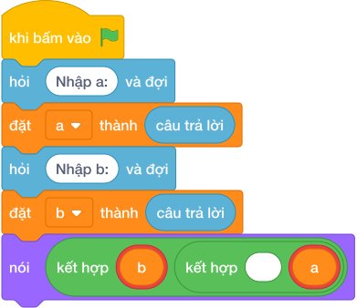

# Hướng Dẫn Giảng Dạy

## 1. Ý tưởng & Phân tích thuật toán

- Bản chất của bài này là đọc hai số rồi in ra theo thứ tự ngược lại: số thứ hai in trước, số thứ nhất in sau.
- Quy trình từng bước với đúng tên biến trong lời giải:
  - Bước 1: `a, b = các khối hỏi và đợi cho từng biến` đọc một dòng, tách thành hai số nguyên. Với mẫu `5 12` thì `a = 5`, `b = 12`.
  - Bước 2: `nói (b, a)` in `b` trước rồi tới `a`, giữa hai số có một dấu cách. Với mẫu này in ra `12 5`.
- Giá trị biên cụ thể: đề bài không giới hạn miền giá trị, nhưng mẫu dùng `5` và `12` đều là số nguyên dương nhỏ; nếu hai số bằng nhau (ví dụ `7 7`) thì kết quả vẫn là `7 7`.

---

## 2. Bảng chạy tay trên số liệu mẫu (Dry Run Table - Sample 1: 5 12)

| Bước | Lệnh chạy | Giá trị của `a` | Giá trị của `b` | In ra màn hình |
|---|---|---|---|---|
| 1 | `a, b = các khối hỏi và đợi cho từng biến` với dòng `5 12` | 5 | 12 | (chưa in gì) |
| 2 | `nói (b, a)` | 5 | 12 | `12 5` |

- Kết quả cuối cùng trùng với kết quả mẫu: `12 5`.

---

## 3. Lưu ý & Bẫy lỗi thường gặp

- Bẫy 1: in nhầm thứ tự cũ `nói (a, b)`. Với mẫu `5 12` sẽ in ra `5 12`, là kết quả sai vì đề bài yêu cầu tráo đổi. Cách sửa: đổi thành `nói (b, a)`.
```text
a, b = các khối hỏi và đợi cho từng biến
nói (a, b)

```
- Bẫy 2: quên tách dòng nhập bằng `split()`, viết `a = câu trả lời` rồi đọc tiếp dòng thứ hai không tồn tại. Với mẫu chỉ có một dòng `5 12`, cách viết sai này đọc `a = 5` rồi chờ thêm dữ liệu. Cách sửa: dùng `các khối hỏi và đợi cho từng biến` để đọc cả hai số trên cùng một dòng.
```text
a = câu trả lời
b = câu trả lời
nói (b, a)

```
- Bẫy 3: in mỗi số một dòng bằng hai lệnh `nói (b)` rồi `nói (a)`. Với mẫu sẽ in hai dòng `12` và `5`, là kết quả sai vì đề bài yêu cầu hai số trên cùng một dòng. Cách sửa: in một lần `nói (b, a)`.
```text
a, b = các khối hỏi và đợi cho từng biến
nói (b)
nói (a)

```

---

## 4. Lời giải tham khảo & Kịch bản Khối lệnh Scratch 3.0

### 4.1. Khối lệnh đồ họa trực quan (Visual Scratch Blocks)



> 💡 **Kịch bản thực hiện từng bước:**
> - khi bấm vào cờ xanh
> - hỏi [Nhập a:] và đợi
> - đặt [a] thành (câu trả lời)
> - hỏi [Nhập b:] và đợi
> - đặt [b] thành (câu trả lời)
> - nói (kết hợp b và ' ' và a)
