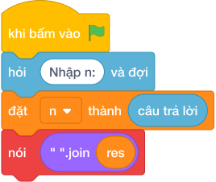

# Hướng Dẫn Giảng Dạy: Dãy số nhân đôi
Chuyên đề: **Lập Trình Thuật Toán & Khối Lệnh Scratch 3.0**

---

## 1. Ý tưởng & Phân tích thuật toán

- Bản chất của bài này là dãy 1, 2, 4, 8, 16, ... trong đó số đầu là 1 và mỗi số sau gấp đôi số trước, cần in `N` số đầu trên cùng một dòng.
- Quy trình từng bước với đúng tên biến trong lời giải:
  - Bước 1: `n = int(câu trả lời.strip())` đọc số lượng cần in. Với mẫu, `n = 5`.
  - Bước 2: đặt `val = 1` là số hiện tại và `res = []` là giỏ đựng các số dưới dạng chuỗi.
  - Bước 3: lặp `n` lần, mỗi lần bỏ `str(val)` vào `res` rồi nhân đôi `val *= 2`.
  - Bước 4: `nói (" ".join(res))` in cả dãy cách nhau bởi dấu cách.
- Giá trị biên cụ thể: khi `n = 1` chỉ in `1`; đề bài giới hạn `1 <= N <= 30` nên số cuối lớn nhất là 2 mũ 29.

---

## 2. Bảng chạy tay trên số liệu mẫu (Dry Run Table - Sample 1: 5)

| Lần lặp | `val` trước khi lặp | Thêm vào `res` | `res` sau lần lặp | `val` sau khi nhân đôi |
|---|---|---|---|---|
| Khởi đầu | 1 | — | [] | 1 |
| 1 | 1 | `1` | [`1`] | 2 |
| 2 | 2 | `2` | [`1`, `2`] | 4 |
| 3 | 4 | `4` | [`1`, `2`, `4`] | 8 |
| 4 | 8 | `8` | [`1`, `2`, `4`, `8`] | 16 |
| 5 | 16 | `16` | [`1`, `2`, `4`, `8`, `16`] | 32 |

- Lệnh in cuối cho ra `1 2 4 8 16`, trùng kết quả mẫu.

---

## 3. Lưu ý & Bẫy lỗi thường gặp

- Bẫy 1: nhân đôi trước khi thêm vào giỏ, khiến dãy mất số 1. Với mẫu `n = 5` sẽ ra `2 4 8 16 32`, là kết quả sai. Cách sửa: thêm `str(val)` vào `res` trước rồi mới `val *= 2`.
```text
n = int(câu trả lời.strip())
val = 1
res = []
for _ in range(n):
    val *= 2
    res.append(str(val))
print(" ".join(res))
```
- Bẫy 2: khởi đầu `val = 2` thay vì `val = 1`. Với mẫu sẽ ra `2 4 8 16 32`, là kết quả sai. Cách sửa: đặt `val = 1`.
```text
n = int(câu trả lời.strip())
val = 2
res = []
for _ in range(n):
    res.append(str(val))
    val *= 2
print(" ".join(res))
```
- Bẫy 3: in mỗi số một dòng bằng `nói (val)` trong vòng lặp. Với mẫu sẽ in 5 dòng thay vì một dòng `1 2 4 8 16`, là kết quả sai. Cách sửa: gom vào `res` rồi in một lần bằng `" ".join(res)`.
```text
n = int(câu trả lời.strip())
val = 1
for _ in range(n):
    print(val)
    val *= 2
```

---

## 4. Lời giải tham khảo & Kịch bản Khối lệnh Scratch 3.0

### 4.1. Khối lệnh đồ họa trực quan (Visual Scratch Blocks)



> 💡 **Kịch bản thực hiện từng bước:**
> - khi bấm vào cờ xanh
> - hỏi [Nhập n:] và đợi
> - đặt [n] thành (câu trả lời)
> - nói (" ".join(res)
