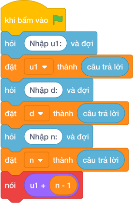

# Hướng Dẫn Giảng Dạy: Số hạng dãy cấp số cộng
Chuyên đề: **Lập Trình Thuật Toán & Khối Lệnh Scratch 3.0**

---

## 1. Ý tưởng & Phân tích thuật toán

- Bản chất của bài này là dãy cách đều: số hạng đầu là `u1`, mỗi số sau hơn số trước đúng `d` đơn vị, cần tìm số hạng thứ `n`.
- Công thức dùng trực tiếp: số hạng thứ `n` bằng `u1 + (n - 1) * d`.
- Quy trình từng bước với đúng tên biến trong lời giải:
  - Bước 1: `u1, d, n = map(int, câu trả lời.split())` đọc ba số. Với mẫu `3 4 5` thì `u1 = 3`, `d = 4`, `n = 5`.
  - Bước 2: tính `(n - 1) * d = 4 * 4 = 16`, cộng `u1` được `3 + 16 = 19`, rồi in ra `19`.
- Giá trị biên cụ thể: khi `n = 1` thì `(n - 1) = 0` nên đáp án luôn bằng chính `u1`; ba số đều nằm trong phạm vi từ 1 tới 1000000 theo đề bài.

---

## 2. Bảng chạy tay trên số liệu mẫu (Dry Run Table - Sample 1: 3 4 5)

| Bước | Việc làm | `u1` | `d` | `n` | Tính toán | In ra |
|---|---|---|---|---|---|---|
| 1 | Đọc dòng `3 4 5` | 3 | 4 | 5 | — | (chưa in) |
| 2 | Tính `n - 1` | 3 | 4 | 5 | `5 - 1 = 4` | (chưa in) |
| 3 | Nhân với `d` | 3 | 4 | 5 | `4 * 4 = 16` | (chưa in) |
| 4 | Cộng `u1` rồi in | 3 | 4 | 5 | `3 + 16 = 19` | `19` |

- Dãy mẫu viết ra là 3, 7, 11, 15, 19 nên số thứ 5 đúng là `19`, trùng kết quả mẫu.

---

## 3. Lưu ý & Bẫy lỗi thường gặp

- Bẫy 1: quên trừ 1, viết `u1 + n * d`. Với mẫu `3 4 5` sẽ tính `3 + 5 * 4 = 23`, là kết quả sai. Cách sửa: nhân với `(n - 1)`.
```text
u1, d, n = map(int, câu trả lời.split())
print(u1 + n * d)
```
- Bẫy 2: cộng `d` thiếu số lần do dùng vòng lặp chạy tới `n` thay vì `n - 1`. Với mẫu sẽ cộng 5 lần và ra `3 + 20 = 23`, là kết quả sai. Cách sửa: dùng đúng công thức `u1 + (n - 1) * d`.
```text
u1, d, n = map(int, câu trả lời.split())
s = u1
for _ in range(n):
    s = s + d
print(s)
```
- Bẫy 3: đọc sai thứ tự ba số, ví dụ tưởng số đầu là `n`. Với mẫu `3 4 5` mà đọc `n = 3, d = 4, u1 = 5` thì ra `5 + 2 * 4 = 13`, là kết quả sai. Cách sửa: giữ đúng thứ tự `u1, d, n`.
```text
n, d, u1 = map(int, câu trả lời.split())
print(u1 + (n - 1) * d)
```

---

## 4. Lời giải tham khảo & Kịch bản Khối lệnh Scratch 3.0

### 4.1. Khối lệnh đồ họa trực quan (Visual Scratch Blocks)



> 💡 **Kịch bản thực hiện từng bước:**
> - khi bấm vào cờ xanh
> - hỏi [Nhập u1:] và đợi
> - đặt [u1] thành (câu trả lời)
> - hỏi [Nhập d:] và đợi
> - đặt [d] thành (câu trả lời)
> - hỏi [Nhập n:] và đợi
> - đặt [n] thành (câu trả lời)
> - nói (u1 + (n - 1)
