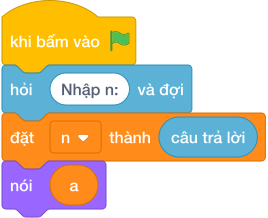

# Hướng Dẫn Giảng Dạy: Số Fibonacci thứ N
Chuyên đề: **Lập Trình Thuật Toán & Khối Lệnh Scratch 3.0**

---

## 1. Ý tưởng & Phân tích thuật toán

- Bản chất của bài này là dãy 1, 1, 2, 3, 5, 8, ... trong đó mỗi số từ số thứ 3 trở đi bằng tổng hai số liền trước.
- Quy trình từng bước với đúng tên biến trong lời giải:
  - Bước 1: `n = int(câu trả lời.strip())` đọc số thứ tự cần tìm. Với mẫu, `n = 6`.
  - Bước 2: đặt `a = 1, b = 1` tượng trưng cho hai số đầu dãy `F1 = 1, F2 = 1`.
  - Bước 3: lặp `n - 1 = 5` lần, mỗi lần gán `a, b = b, a + b` để trượt cặp số về phía trước.
  - Bước 4: `nói (a)` in ra số thứ `n`.
- Giá trị biên cụ thể: khi `n = 1` thì vòng lặp chạy 0 lần và in `a = 1`; đề bài giới hạn `1 <= N <= 40` nên số lớn nhất cần in là số thứ 40.

---

## 2. Bảng chạy tay trên số liệu mẫu (Dry Run Table - Sample 1: 6)

| Lần lặp | `a` trước khi lặp | `b` trước khi lặp | `a` sau khi lặp | `b` sau khi lặp |
|---|---|---|---|---|
| Khởi đầu | 1 | 1 | — | — |
| 1 | 1 | 1 | 1 | 2 |
| 2 | 1 | 2 | 2 | 3 |
| 3 | 2 | 3 | 3 | 5 |
| 4 | 3 | 5 | 5 | 8 |
| 5 | 5 | 8 | 8 | 13 |

- Sau 5 lần lặp thì `a = 8`, lệnh `nói (a)` in ra `8`, trùng kết quả mẫu. Dãy viết ra là 1, 1, 2, 3, 5, 8 nên số thứ 6 đúng là 8.

---

## 3. Lưu ý & Bẫy lỗi thường gặp

- Bẫy 1: lặp đúng `n` lần thay vì `n - 1` lần. Với mẫu `n = 6` sẽ lặp 6 lần và `a` thành 13, là kết quả sai. Cách sửa: dùng `range(n - 1)`.
```text
n = int(câu trả lời.strip())
a, b = 1, 1
for _ in range(n):
    a, b = b, a + b
print(a)
```
- Bẫy 2: khởi đầu sai cặp số, ví dụ `a, b = 0, 1`. Với mẫu `n = 6` dãy sẽ thành 0, 1, 1, 2, 3, 5 và in ra 5, là kết quả sai. Cách sửa: khởi đầu `a, b = 1, 1` đúng định nghĩa `F1 = 1, F2 = 1`.
```text
n = int(câu trả lời.strip())
a, b = 0, 1
for _ in range(n - 1):
    a, b = b, a + b
print(a)
```
- Bẫy 3: in nhầm `b` thay vì `a`. Với mẫu sau 5 lần lặp `b = 13` nên in ra 13, là kết quả sai (số thứ 7 chứ không phải số thứ 6). Cách sửa: in `nói (a)`.
```text
n = int(câu trả lời.strip())
a, b = 1, 1
for _ in range(n - 1):
    a, b = b, a + b
print(b)
```

---

## 4. Lời giải tham khảo & Kịch bản Khối lệnh Scratch 3.0

### 4.1. Khối lệnh đồ họa trực quan (Visual Scratch Blocks)



> 💡 **Kịch bản thực hiện từng bước:**
> - khi bấm vào cờ xanh
> - hỏi [Nhập n:] và đợi
> - đặt [n] thành (câu trả lời)
> - nói (a)
